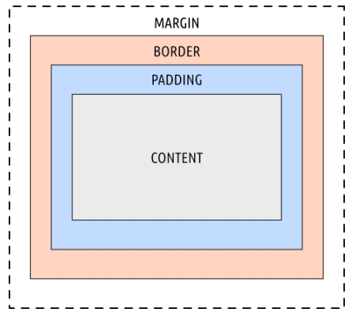
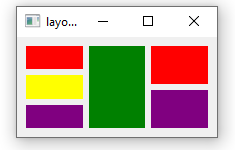
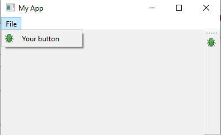
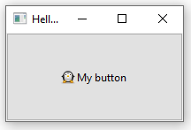
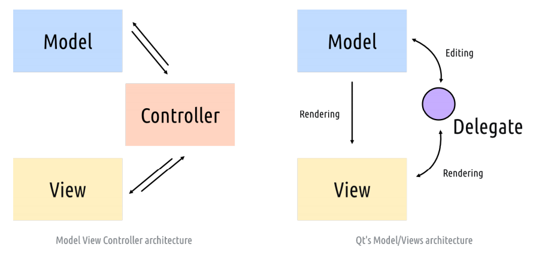
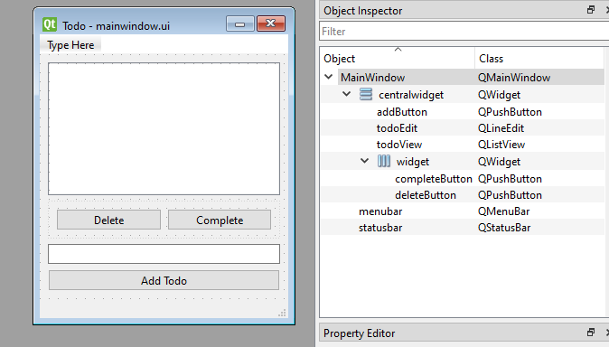

## 1. 开发环境

```
vscode
pylance # 默认存在
pip install PySide6 # PySide6==6.8.0.2
# 智能补全参考
https://blog.csdn.net/qq_42692823/article/details/132214353
https://code.visualstudio.com/docs/languages/python
https://code.visualstudio.com/docs/python/editing
```


## 2. 基本特性


### 2.1 窗口 

- Hello World:
```python
from PySide6.QtWidgets import QApplication,QWidget
import sys

app = QApplication(sys.argv)

window = QWidget()
window.show()

# Start the event loop
app.exec()

# Your application won't reach here until you exit and the event
# loop has stopped

# QApplication holds the Qt event loop

# There is only one event loop at any time
```

- 在前面基础上重写QMainWindow类
```python
import sys

from PySide6.QtCore import QSize,Qt
from PySide6.QtWidgets import (
    QApplication,
    QMainWindow,
    QPushButton
)


class MyMainWindow(QMainWindow):
    def __init__(self):
        super().__init__()
        self.setWindowTitle("My App")
        button = QPushButton("Press Me!")
        self.setCentralWidget(button)
        
app = QApplication(sys.argv)

window = MyMainWindow()
window.show()

# Start the event loop
app.exec()
```

### 2.2 Signals & Slots

- 将QPushButton自身的clicked信号和自定义槽函数相连接
```python
import sys

from PySide6.QtWidgets import (
    QApplication,
    QPushButton
)

def btnClicked(self):
    print("Clicked!")

app = QApplication(sys.argv)

button = QPushButton("Click me")
button.show()

button.clicked.connect(btnClicked)

# Start the event loop
app.exec()
```
- 可以将一个组件的信号连接到另一个组件的槽函数
```python
from PySide6.QtWidgets import (
  QApplication,
  QMainWindow,
  QLabel,
  QLineEdit,
  QVBoxLayout,
  QWidget,
)
import sys

class MainWindow(QMainWindow):
    def __init__(self):
        super().__init__()
        self.setWindowTitle("My App")
        self.label = QLabel()
        self.input = QLineEdit()

        # 将input的textChanged信号连接到label的setText函数
        self.input.textChanged.connect(self.label.setText)

        layout = QVBoxLayout() 
        layout.addWidget(self.input)
        layout.addWidget(self.label)
        
        container = QWidget()
        container.setLayout(layout)
        # Set the central widget of the Window.
        self.setCentralWidget(container)

app = QApplication(sys.argv)
window = MainWindow()
window.show()
app.exec()
```

### 2.3 Widgets

- box model


主要了解组件的信号和成员函数相关属性。

如QLineEdit的相关文档:  
https://doc.qt.io/qtforpython-6/PySide6/QtWidgets/QLineEdit.html#PySide6.QtWidgets.QLineEdit

### 2.4 Layout

| 基本布局           | 行为                               |
| -------------- | -------------------------------- |
| QHBoxLayout    | 线性水平布局                           |
| QVBoxLayout    | 线性垂直布局                           |
| QGridLayout    | 网格布局                             |
| QStackedLayout | 互相堆叠布局，setCurrentIndex选择显示某个在最上层 |
| QFormLayout    | 表单布局                             |
- 通常步骤：
1. 创建布局：`layout = QVBoxLayout()`
2. 添加组件到布局
3. widget设置布局
4. windows显示widget
```python
layout = QVBoxLayout()

layout.addWidget(Color('red'))
layout.addWidget(Color('green'))
layout.addWidget(Color('blue'))

widget = QWidget()
widget.setLayout(layout)

self.setCentralWidget(widget)
```

- 布局还可以嵌套布局
```python
layout1 = QHBoxLayout()
layout2 = QVBoxLayout()
layout3 = QVBoxLayout()

layout2.addWidget(Color('red'))
layout2.addWidget(Color('yellow'))
layout2.addWidget(Color('purple'))

layout1.addLayout(layout2)
layout1.addWidget(Color('green'))

layout3.addWidget(Color('red'))
layout3.addWidget(Color('purple'))
layout1.addLayout(layout3)
```



### 2.5 Action, Toolbars & Menus


QAction是一个动作，包含了文本描述、图标、快捷键、回调函数（信号槽）等等信息，menu、toolbar、右键菜单均可添加qaction给用户点击，如
```python
class MainWindow(QMainWindow):
    def __init__(self):
        super().__init__()

        self.setWindowTitle("My App")

        toolbar = QToolBar("My main toolbar")
        toolbar.setIconSize(QSize(16, 16))
        self.addToolBar(toolbar)

		# 创建action
        button_action = QAction(
            QIcon("bug.png"),
            "&Your button",
            self,
        )
        button_action.setStatusTip("This is your button")
        button_action.triggered.connect(self.onMyToolBarButtonClick)
        button_action.setCheckable(True)
        toolbar.addAction(button_action)

        # 把action添加到菜单栏
        menu = self.menuBar()
        file_menu = menu.addMenu("&File")
        file_menu.addAction(button_action)

    def onMyToolBarButtonClick(self,s):
        print("click", s)
```


点击两者都是调用同一个QAction对应的槽函数。


### 2.6 Dialogs

- QMessageBox
- QInputDialog
- QFileDialog
### 2.7 Windows

### 2.8 Events


## 3. Qt Designer

### 3.1 ui文件生成与使用

- 启动Qt Designer
```
pyside6-designer
```


- 创建ui文件并加载显示
```python
import os
import sys

from PySide6 import QtWidgets
from PySide6.QtUiTools import QUiLoader


basedir = os.path.dirname(__file__)
loader = QUiLoader()

app = QtWidgets.QApplication(sys.argv)
window = loader.load(os.path.join(basedir, "mainwindow.ui"), None)
window.show()
app.exec()
```


- ui文件转python文件：
```
pyside6-uic mainwindow.ui -o MainWindow.py
```


- 交互：一个label、一个pushButton
```python
import random
import sys

from PySide6.QtCore import Qt
from PySide6.QtWidgets import QApplication, QMainWindow

from MainWindow import Ui_MainWindow

class MainWindow(QMainWindow, Ui_MainWindow):
    def __init__(self):
        super().__init__()
        self.setupUi(self)
        self.show()

        # You can still override values from your UI file within your code,
        # but if possible, set them in Qt Creator. See the properties panel.
        f = self.label.font()
        f.setPointSize(25)
        self.label.setAlignment(Qt.AlignHCenter | Qt.AlignVCenter)
        self.label.setFont(f)
        
        # Signals from UI widgets can be connected as normal.
        self.pushButton.pressed.connect(self.update_label)
    def update_label(self):
        n = random.randint(1, 6)
        self.label.setText("%d" % n)

app = QApplication(sys.argv)
w = MainWindow()
app.exec()

```

### 3.2 qrc文件生成与使用

- qrc文件例子：  
```
<!DOCTYPE RCC>
<RCC version="1.0">
  <qresource prefix="icons">
  <file alias="penguin.png">animal-penguin.png</file>
  </qresource>
</RCC>
```

- QRC文件编译：
```
pyside6-rcc resources.qrc -o resources.py
```


- qrc文件使用
```
import sys

from PySide6 import QtGui, QtWidgets
import resources # Import the compiled resource file.


class MainWindow(QtWidgets.QMainWindow):
  def __init__(self):
    super().__init__()
    self.setWindowTitle("Hello World")
    b = QtWidgets.QPushButton("My button")
    icon = QtGui.QIcon(":/icons/animal-penguin.png")
    b.setIcon(icon)
    self.setCentralWidget(b)
    self.show()
app = QtWidgets.QApplication(sys.argv)
w = MainWindow()
app.exec()
```

- 结果
 

### 3.3 添加qrc到qt designer

1. 在qt designer添加资源图片。
2. 修改button图标，从资源中选择。
3. 编译ui文件。
4. 编译qrc文件（根据上一步提示缺失import命名）。
5. 编译逻辑代码py。


## 4. 主题

### 4.1 统一主题


- Fusion主题
```python
app = QApplication(sys.argv)
app.setStyle('Fusion')
#...
app.exec()
```

### 4.2 颜色建议

- 数据可视化程序
	- https://colorbrewer2.org
- 上下文颜色、高亮或者少量颜色
	- https://coolors.co


### 4.3 icon

- 设置内置图标
```python
from PySide6.QtWidgets import QApplication, QMainWindow,QPushButton,QStyle
import sys


class MainWindow(QMainWindow):
    def __init__(self):
        super().__init__()

        button = QPushButton()

        style = button.style() # Get the QStyle object from the widget.
        icon = style.standardIcon(QStyle.StandardPixmap.SP_ArrowBack)
        button.setIcon(icon)
        
        self.setCentralWidget(button)

app = QApplication(sys.argv)
w = MainWindow() # Replace with your QMainWindow instance.
w.show()
app.exec()
```


### 4.4 QSS

1. 代码设置
```python
self.setStyleSheet("QLabel { background-color: yellow }")
```
2. 在Qt Designer设置


## 5. The Model View Architecture

- Qt's MVC-like interface for displaying data in views。
- MVC
	- Model 
		- 选择模型
		- 数据模型
			- 程序处理的数据结构，把数据封装成对象。
	- View
		- 展现给用户的视图，如QTableView、QListView、QTreeView等。
	- Controller
		- 把视图改变反馈到模型，把模型里的数据集呈现到视图。
- qt的模型视图与mvc区别




### 5.1 QListView - todo app实例

- QT Designer ui文件

- 代码
```python
import json
import os
import sys

from PySide6.QtCore import QAbstractListModel, Qt
from PySide6.QtGui import QImage
from PySide6.QtWidgets import QApplication, QMainWindow

from MainWindow import Ui_MainWindow

basedir = os.path.dirname(__file__)

tick = QImage(os.path.join(basedir, "tick.png"))


class TodoModel(QAbstractListModel):
    """
    继承一维结构模型
    该模型适合QListView视图类使用
    必须实现data、rowCount函数，参考https://doc.qt.io/qtforpython-6/PySide6/QtCore/QAbstractListModel.html#PySide6.QtCore.QAbstractListModel
    """
    def __init__(self, todos=None):
        super().__init__()
        self.todos = todos or []        # 使用列表存储数据源

    # 返回索引和角色指定的数据给视图
    # index保存了行、列、父信息，由于只使用了一维结构，这里只用到行index.row()
    # 更多role参考：https://doc.qt.io/qt-6/qt.html#ItemDataRole-enum
    def data(self, index, role):
        if role == Qt.DisplayRole:      # 视图获取字符串数据
            status, text = self.todos[index.row()]
            return text

        if role == Qt.DecorationRole:   # 视图获取图标数据
            status, text = self.todos[index.row()]
            if status:
                return tick

        if role == Qt.ToolTipRole:      # 鼠标悬停在列表中获取tooltip
            status, text = self.todos[index.row()]
            return text + ":" + "ToolTip"
    
    # 返回行数给视图
    def rowCount(self, index):
        return len(self.todos)


class MainWindow(QMainWindow, Ui_MainWindow):
    def __init__(self):
        super().__init__()
        self.setupUi(self)
        self.model = TodoModel()
        self.load()
        self.todoView.setModel(self.model)
        self.addButton.pressed.connect(self.add)
        self.deleteButton.pressed.connect(self.delete)
        self.completeButton.pressed.connect(self.complete)

    def add(self):
        """
        添加条目到模型
        出发模型改变时间
        清空QLineEdit
        delete、complete函数同理
        """
        text = self.todoEdit.text()
        # Remove whitespace from the ends of the string.
        text = text.strip()
        if text:  # Don't add empty strings.
            # Access the list via the model.
            self.model.todos.append((False, text))
            # Trigger refresh.
            self.model.layoutChanged.emit()
            # Empty the input
            self.todoEdit.setText("")
            self.save()

    def delete(self):
        indexes = self.todoView.selectedIndexes()
        if indexes:
            # Indexes is a single-item list in single-select mode.
            index = indexes[0]
            # Remove the item and refresh.
            del self.model.todos[index.row()]
            self.model.layoutChanged.emit()
            # Clear the selection (as it is no longer valid).
            self.todoView.clearSelection()
            self.save()

    def complete(self):
        indexes = self.todoView.selectedIndexes()
        if indexes:
            index = indexes[0]
            row = index.row()
            status, text = self.model.todos[row]
            self.model.todos[row] = (True, text)
            # .dataChanged takes top-left and bottom right, which are equal
            # for a single selection.
            self.model.dataChanged.emit(index, index)
            # Clear the selection (as it is no longer valid).
            self.todoView.clearSelection()
            self.save()

    def load(self):
        try:
            with open("data.json", "r") as f:
                self.model.todos = json.load(f)
        except Exception:
            pass

    def save(self):
        with open("data.json", "w") as f:
            data = json.dump(self.model.todos, f)


app = QApplication(sys.argv)
window = MainWindow()
window.show()
app.exec()
```

### 5.2 QTableView

基本原理同上5.1  
可能会用到的库：
- Numpy
	- 支持高效的多数组与矩阵运算
- Pandas
	- 快速、灵活、和易于理解的数据结构，以此让处理关系型数据和带有标签的数据时更简单直观

### 5.3 数据库模型
- sqlite测试数据源
	- https://github.com/anon-note/anon-note.github.io/blob/master/docs/content/images/chinook.sqlite
- sqlite例子
```python
import os
import sys
from PySide6.QtCore import QSize, Qt
from PySide6.QtSql import QSqlDatabase, QSqlTableModel
from PySide6.QtWidgets import QApplication, QMainWindow, QTableView

class MainWindow(QMainWindow):
  def __init__(self):
    super().__init__()
    self.table = QTableView()

    basedir = os.path.dirname(__file__)
    db = QSqlDatabase("QSQLITE")
    db.setDatabaseName(os.path.join(basedir, "chinook.sqlite"))
    db.open()

	# 模型
    self.model = QSqlTableModel(db=db)
    # 设置模型
    self.table.setModel(self.model)
    # 选择表
    self.model.setTable("Track")
    # 显示、刷新
    self.model.select()
    self.setMinimumSize(QSize(1024, 600))
    self.setCentralWidget(self.table)

app = QApplication(sys.argv)
window = MainWindow()
window.show()
app.exec()
```

 - QDataWidgetMapper 映射模型数据到相关widget上
```python
import os
import sys
from PySide6.QtCore import QSize, Qt
from PySide6.QtSql import QSqlDatabase, QSqlTableModel
from PySide6.QtWidgets import (
  QApplication,
  QComboBox,
  QDataWidgetMapper,
  QDoubleSpinBox,
  QFormLayout,
  QHBoxLayout,
  QLabel,
  QLineEdit,
  QMainWindow,
  QPushButton,
  QSpinBox,
  QVBoxLayout,
  QWidget,
)


class MainWindow(QMainWindow):
  def __init__(self):
    super().__init__()
    form = QFormLayout()
    self.track_id = QSpinBox()
    self.track_id.setRange(0, 2147483647)
    self.track_id.setDisabled(True)
    self.name = QLineEdit()
    self.album = QComboBox()
    self.media_type = QComboBox()
    self.genre = QComboBox()
    self.composer = QLineEdit()
    self.milliseconds = QSpinBox()
    self.milliseconds.setRange(0, 2147483647) 
    self.milliseconds.setSingleStep(1)
    self.bytes = QSpinBox()
    self.bytes.setRange(0, 2147483647)
    self.bytes.setSingleStep(1)
    self.unit_price = QDoubleSpinBox()
    self.unit_price.setRange(0, 999)
    self.unit_price.setSingleStep(0.01)
    self.unit_price.setPrefix("$")
    form.addRow(QLabel("Track ID"), self.track_id)
    form.addRow(QLabel("Track name"), self.name)
    form.addRow(QLabel("Composer"), self.composer)
    form.addRow(QLabel("Milliseconds"), self.milliseconds)
    form.addRow(QLabel("Bytes"), self.bytes)
    form.addRow(QLabel("Unit Price"), self.unit_price)

    basedir = os.path.dirname(__file__)
    db = QSqlDatabase("QSQLITE")
    db.setDatabaseName(os.path.join(basedir, "chinook.sqlite"))
    db.open()

    self.model = QSqlTableModel(db=db)
    self.mapper = QDataWidgetMapper() 
    self.mapper.setModel(self.model)
    # 把数据库数据字段映射到widget上
    self.mapper.addMapping(self.track_id, 0) 
    self.mapper.addMapping(self.name, 1)
    self.mapper.addMapping(self.composer, 5)
    self.mapper.addMapping(self.milliseconds, 6)
    self.mapper.addMapping(self.bytes, 7)
    self.mapper.addMapping(self.unit_price, 8)
    self.model.setTable("Track")
    self.model.select() 
    # 选择显示第一行数据
    self.mapper.toFirst() 
    self.setMinimumSize(QSize(400, 400))

    controls = QHBoxLayout()
    prev_rec = QPushButton("Previous")
    prev_rec.clicked.connect(self.mapper.toPrevious)
    next_rec = QPushButton("Next")
    next_rec.clicked.connect(self.mapper.toNext)
    save_rec = QPushButton("Save Changes")
    # 对widget内容的修改可以提交到数据库
    save_rec.clicked.connect(self.mapper.submit)
    controls.addWidget(prev_rec)
    controls.addWidget(next_rec)
    controls.addWidget(save_rec)
    
    layout = QVBoxLayout()

    layout.addLayout(form)
    layout.addLayout(controls)

    widget = QWidget()
    widget.setLayout(layout)
    self.setCentralWidget(widget)

app = QApplication(sys.argv)
window = MainWindow()
window.show()
app.exec()
```
## 参考

https://doc.qt.io/qtforpython-6/  
https://www.pythonguis.com/pyside6/