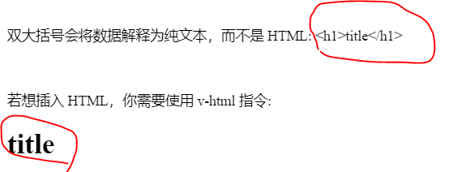
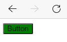
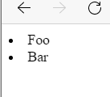
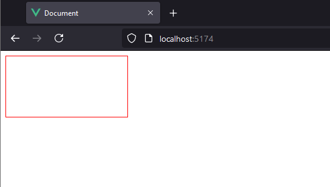
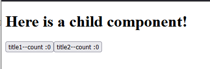
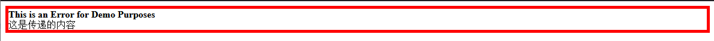
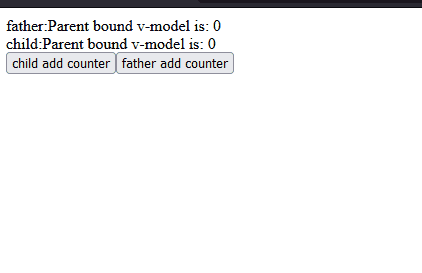
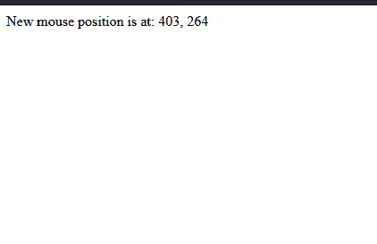
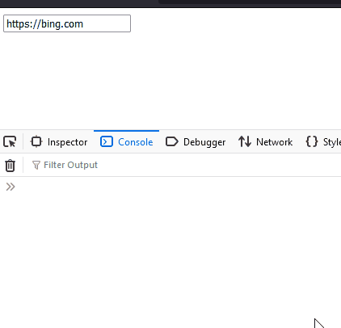
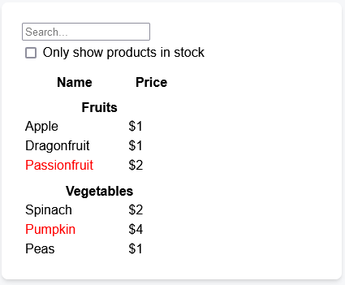

## 环境安装

```shell
npm create vue@latest
# 这一指令将会安装并执行 create-vue，它是 Vue 官方的项目脚手架工具。
# 如果不确定是否要开启某个功能，你可以直接按下回车键选择 No。
cd <your-project-name>
npm install
npm run dev

# 你现在应该已经运行起来了你的第一个 Vue 项目！请注意，生成的项目中的示例组件使用的是组合式 API 和 <script setup>

# 开发工具
vscode + “Vue - Official”插件
```

## 组合式api例子

```vue
<script setup>
import { ref, onMounted } from 'vue'

// 响应式状态
const count = ref(0)

// 用来修改状态、触发更新的函数
function increment() {
  count.value++
}

// 生命周期钩子
onMounted(() => {
  console.log(`The initial count is ${count.value}.`)
})
</script>

<template>
  <button @click="increment">Count is: {{ count }}</button>
</template>
```

## hello world

```vue
<script setup>
import { ref, onMounted } from 'vue'

// 响应式状态
const count = ref(0)

console.log(count)

// 用来修改状态、触发更新的函数
function increment() {
  count.value++
}

// 生命周期钩子
onMounted(() => {
  console.log(`The initial count is ${count.value}.`)
})
</script>

<template>
  <button @click="increment">Count is: {{ count }}</button>
</template>
```

```html
<!DOCTYPE html>
<html lang="en">
<head>
  <meta charset="UTF-8">
  <meta name="viewport" content="width=device-width, initial-scale=1.0">
  <title>Document</title>
</head>
<body>
  <div id="app"></div>

  <script type="module" src="/src/main.js"></script>
  
</body>
</html>
```

```js
import { createApp } from 'vue'
import App from './App.vue'

const app = createApp(App)
# 挂在到html的<div id="app"></div>
app.mount('#app')
```

## 模板语法

###  原始html
```vue
<script setup>
import { ref, onMounted } from 'vue'

const rawHtml = "<h1>title</h1>"

</script>

<template>
  <p>双大括号会将数据解释为纯文本，而不是 HTML: {{ rawHtml }}</p>
  <br>
  <p>若想插入 HTML，你需要使用 v-html 指令: <span v-html="rawHtml"></span></p>
</template>
```


- **在网站上动态渲染任意 HTML 是非常危险的，因为这非常容易造成 XSS 漏洞。请仅在内容安全可信时再使用 v-html，并且永远不要使用用户提供的 HTML 内容**


### Attribute 绑定 

- html 属性绑定
	- 双大括号不能在 HTML attributes 中使用。想要响应式地绑定一个 attribute，应该使用 v-bind 指令：
```vue
<!-- 把div的id与dynamicId变量绑定 -->
<div v-bind:id="dynamicId"></div>

<!-- 简写，去掉v-bind只使用":" -->
<div :id="dynamicId"></div>

<!-- 同名简写，与 :id="id" 相同 -->
<div :id></div>

<!-- 这也同样有效 -->
<div v-bind:id></div>
```

#### 动态绑定多个值

```vue
<script setup>
import { ref, onMounted } from 'vue'

const objectOfAttrs = {
  id: 'container',
  style: 'background-color:green'
}
</script>

<template>
  <button v-bind="objectOfAttrs">Button</button>
</template>
```


### 使用 JavaScript 表达式 

- Vue 实际上在所有的数据绑定中都支持完整的 JavaScript 表达式：
```vue
<script setup>
import { ref, onMounted } from 'vue'

var str1 = "hello "
var str2 = "world"

var id=1
</script>

<template>
  <p>say: {{str1 + str2}}</p>
  <!-- 如果id=1，则结果为 <div :id="list-1"></div> -->
  <div :id="`list-${id}`"></div>
</template>
```


### 受限的全局访问 

模板中的表达式将被沙盒化，仅能够访问到有限的全局对象列表。该列表中会暴露常用的内置全局对象，比如 Math 和 Date。

### 指令 Directives

- 指令是带有 v- 前缀的特殊 attribute。这里，v-if 指令会基于表达式 seen 的值的真假来移除/插入该 p 元素。

```vue
<p v-if="seen">Now you see me</p>
```

- 另一个例子是 v-on 指令，它将监听 DOM 事件：
```vue
<a v-on:click="doSomething"> ... </a>

<!-- 简写 -->
<a @click="doSomething"> ... </a>
```

## 响应式基础 

### ref()

- 当你在模板中使用了一个 ref，然后改变了这个 ref 的值时，Vue 会自动检测到这个变化，并且相应地更新 DOM。
- ref() 接收参数，并将其包裹在一个带有 .value 属性的 ref 对象中返回：

```js
const count = ref(0)

console.log(count) // { value: 0 }
console.log(count.value) // 0

count.value++
console.log(count.value) // 1
```

- 原理
```js
// 伪代码，不是真正的实现
const myRef = {
  _value: 0,
  get value() {
    track()
    return this._value
  },
  set value(newValue) {
    this._value = newValue
    trigger()
  }
}
```

### 什么时候需要ref.value？什么时候不需要？

- 在script中的时候需要
- 在template中的时候不需要

### reactive
- 它只能用于对象类型 (对象、数组和如 Map、Set 这样的集合类型)。它不能持有如 string、number 或 boolean 这样的原始类型。
```vue
<script setup>
import { reactive} from 'vue'

var count = reactive({count:0})

function handleClick(){
  // 不需要.value
  count.count++;
}
</script>

<template>
<button @click="handleClick">
{{count.count}}
</button>
</template>
```


### DOM 更新时机 

- 当你修改了响应式状态时，DOM 会被自动更新。但是需要注意的是，DOM 更新不是同步的。Vue 会在“next tick”更新周期中缓冲所有状态的修改，以确保不管你进行了多少次状态修改，每个组件都只会被更新一次。

要等待 DOM 更新完成后再执行额外的代码，可以使用 nextTick() 全局 API：
```js
import { nextTick } from 'vue'

async function increment() {
  count.value++
  await nextTick()
  // 现在 DOM 已经更新了
}
```


## 计算属性


## Class 与 Style 绑定

### 绑定 HTML class 

- <div class="static active"></div>
- 如果 hasError 变为 true，class 列表也会变成 "static active text-danger"
```vue
<div
  class="static"
  :class="{ active: isActive, 'text-danger': hasError }" 
></div>
```

### 绑定内联样式 


```vue
<script setup>
import { ref} from 'vue'

const fontSize = ref(30)
</script>

<template>
<div :style="{ 'font-size': fontSize + 'px' }"></div>
</template>
```


## 条件渲染


- 一个 v-else 元素必须跟在一个 v-if 或者 v-else-if 元素后面，否则它将不会被识别。
```vue
<script setup>
import { ref} from 'vue'

const awesome = ref(false)

</script>

<template>
<button @click="awesome = !awesome">Toggle</button>
<h1 v-if="awesome">Vue is awesome!</h1>
<h1 v-else>Oh no 😢</h1>
</template>
```

### `<template>`上的 v-if

因为 v-if 是一个指令，他必须依附于某个元素。但如果我们想要切换不止一个元素呢？在这种情况下我们可以在一个 `<template>` 元素上使用 v-if，这只是一个不可见的包装器元素，最后渲染的结果并不会包含这个 `<template>` 元素。

```vue
<template v-if="ok">
  <h1>Title</h1>
  <p>Paragraph 1</p>
  <p>Paragraph 2</p>
</template>
```


- v-show
```vue
<h1 v-show="ok">Hello!</h1>

# 原理是v-show 仅切换了该元素上名为 display 的 CSS 属性。本身元素还是存在。
```


## 列表渲染 

```vue
<script setup>
import { ref} from 'vue'

const items = ref([{ message: 'Foo' }, { message: 'Bar' }])

</script>

<template>
<li v-for="item in items">
  {{ item.message }}
</li>
</template>
```



- 访问列表索引
```vue
<li v-for="(item, index) in items">
  {{ parentMessage }} - {{ index }} - {{ item.message }}
</li>
```


### v-for 与对象 

- myObject是一个对象
```vue
<ul>
  <li v-for="value in myObject">
    {{ value }}
  </li>
</ul>
```


### 在 v-for 里使用范围值 

```vue
<span v-for="n in 10">{{ n }}</span>
```

### `<template>` 上的 v-for

与模板上的 v-if 类似，你也可以在 `<template>` 标签上使用 v-for 来渲染一个包含多个元素的块。例如：  

```vue
<ul>
  <template v-for="item in items">
    <li>{{ item.msg }}</li>
    <li class="divider" role="presentation"></li>
  </template>
</ul>
```


### 展示过滤后的结果 

```vue
<script setup>
import { ref} from 'vue'

var searchQuery = "";

var sentenceArray = [
  "The quick brown fox jumps over the lazy dog.",
  "A journey of a thousand miles begins with a single step.",
  "To be or not to be, that is the question.",
  "All that glitters is not gold.",
  "In the end, we will remember not the words of our enemies, but the silence of our friends.",
  "The only limit to our realization of tomorrow will be our doubts of today.",
  "Life is what happens when you're busy making other plans.",
  "The best way to predict the future is to create it.",
  "It does not matter how slowly you go as long as you do not stop.",
  "Success is not final, failure is not fatal: It is the courage to continue that counts."
];

var filteredResults = ref(sentenceArray); // 使用 ref 定义响应式的过滤结果

function  search() {
  console.log("searchQuery:"+searchQuery);

  // 注意用value
  filteredResults.value = sentenceArray.filter(item => item.toLowerCase().includes(searchQuery.toLocaleLowerCase()));
  
  console.log("filteredResults:"+filteredResults)
}

</script>

<template>
<input type="text" v-model="searchQuery" placeholder="type for search" @input="search">
<ul v-if="filteredResults.length">
    <li v-for="(result, index) in filteredResults" :key="index">
      {{ result }}
    </li>
</ul>
<p v-else>没有找到结果</p>
</template>
```


## 事件处理 


- 用法：v-on:click="handler" 或 @click="handler"。

### 内联事件处理器

- 简单场景
```vue
<button @click="count++">Add 1</button>
```

- 带自定义参数和事件参数(事件参数可以忽略)
```vue
<script setup>
function say(message,event) {
  alert(message)
  alert(event)
}
</script>

<template>
	<button @click="say('hello',$event)">Say hello</button>
	<button @click="say('bye',$event)">Say bye</button>
</template>
```

### 方法事件处理器 

```vue
<script setup>
import { ref} from 'vue'

const name = ref('Vue.js')

function greet(event) {
  alert(`Hello ${name.value}!`)
  // `event` 是 DOM 原生事件
  if (event) {
    alert(event.target.tagName)
  }
}
</script>

<template>
<!-- `greet` 是上面定义过的方法名 -->
<button @click="greet">Greet</button>
</template>
```

### 特定按键事件监听

```vue
<!-- 仅在 `key` 为 `Enter` 时调用 `submit` -->
<input @keyup.enter="submit" />

<input @keyup.page-down="onPageDown" />
```

- Vue 为一些常用的按键提供了别名：
```
.enter
.tab
.delete (捕获“Delete”和“Backspace”两个按键)
.esc
.space
.up
.down
.left
.right
# 系统按键修饰符 
.ctrl
.alt
.shift
# 在 Mac 键盘上，meta 是 Command 键 (⌘)。在 Windows 键盘上，meta 键是 Windows 键 (⊞)。
.meta
```

- 例子
```vue
<!-- Alt + Enter -->
<input @keyup.alt.enter="clear" />

<!-- Ctrl + 点击 -->
<div @click.ctrl="doSomething">Do something</div>
```

### 鼠标按键例子

- 鼠标按键修饰符
```
.left
.right
.middle
```


- 鼠标右键点击按钮例子
```vue
<script setup>
function mousedownright(message,event) {
  alert(message)
  alert(event)
}
</script>

<template>
	<button @mousedown.right="mousedownright('bye',$event)">Say bye</button>
</template>
```


## 表单输入绑定v-model

- 将表单元素的值与js变量绑定
- v-model
	- v-model 会忽略任何表单元素上初始的 value、checked 或 selected attribute。它将始终将当前绑定的 JavaScript 状态视为数据的正确来源。你应该在 JavaScript 中使用响应式系统的 API来声明该初始值。
- 例子
```vue
<script setup>
import { ref } from 'vue';

var message = ref("hello world");

</script>

<template>
	<p>Message is: {{ message }}</p>
	<input v-model="message" placeholder="edit me" />
</template>
```

- 绑定多个复选框
```vue
<script setup>
import { ref } from 'vue';
const checkedNames = ref([])

// 三个都选择结果为Checked names: [ "Mike", "Jack", "John" ]
</script>

<template>
<div>Checked names: {{ checkedNames }}</div>

<input type="checkbox" id="jack" value="Jack" v-model="checkedNames" />
<label for="jack">Jack</label>

<input type="checkbox" id="john" value="John" v-model="checkedNames" />
<label for="john">John</label>

<input type="checkbox" id="mike" value="Mike" v-model="checkedNames" />
<label for="mike">Mike</label>
</template>
```


## 声明周期


- onMounted 钩子可以用来在组件完成初始渲染并创建 DOM 节点后运行代码：
```vue
<script setup>
import { onMounted } from 'vue'

onMounted(() => {
  console.log(`the component is now mounted.`)
})
</script>
```

## 侦听器 watch-watchEffect

- 在组合式 API 中，我们可以使用 watch 函数在每次响应式状态发生变化时触发回调函数：
- 需要声明数据源
```vue
<script setup>
import { ref, watch } from 'vue'

var inputValue = ref("")


// 监听 inputValue的变化
watch(inputValue, async (newValue,oldValue) => {
  console.log(oldValue+">"+newValue)
})

</script>

<template>
  <input type="text" v-model="inputValue">
</template>
```

- watchEffect简化watch
	- 无需声明数据源，响应性数据源存在回调函数内即可
	- 响应性数据源变化时候会自动执行
	- watchEffect() 允许我们自动跟踪回调的响应式依赖。上面的侦听器可以重写为：
```vue
<script setup>
import { ref, watch, watchEffect } from 'vue'

var inputValue = ref("")

watchEffect(() => {
  // 因为他是一个函数，所以里面可以编写任何代码
  console.log("current value"+inputValue.value)
})
</script>

<template>
  <input type="text" v-model="inputValue">
</template>
```


- 更多
	- https://cn.vuejs.org/guide/essentials/watchers.html


## 模板引用

- 下面例子相当于js的document.getElementById(“my-div”)
- 模板的ref引用

```vue
<script setup>
import { useTemplateRef, onMounted } from 'vue'

// 第一个参数必须与模板中的 ref 值匹配
const div = useTemplateRef('my-div')

onMounted(() => {
 
  div.value.style.width = "200px";
  div.value.style.height = "100px";
  div.value.style.border = "1px solid red";
  console.log(div)

})
</script>

<template>
  <div ref="my-div" />
</template>
```

- 效果 

- 注意
	- 你只可以在组件挂载后才能访问模板引用。如果你想在模板中的表达式上访问 input，在初次渲染时会是 null。这是因为在初次渲染前这个元素还不存在呢！

### v-for 中的模板引用 
- 此时itemRefs是数组，且并不保证与源数组相同的顺序
```vue
<script setup>
import { ref, useTemplateRef, onMounted } from 'vue'

const list = ref([
  /* ... */
])

const itemRefs = useTemplateRef('items')

onMounted(() => console.log(itemRefs.value))
</script>

<template>
  <ul>
    <li v-for="item in list" ref="items">
      {{ item }}
    </li>
  </ul>
</template>
```


## 组件基础

### 定义一个组件 

- 当使用构建步骤时，我们一般会将 Vue 组件定义在一个单独的 .vue 文件中，这被叫做单文件组件 (简称 SFC)：
- button.vue
```vue
<script setup>
import { ref } from 'vue'

const count = ref(0)
</script>

<template>
  <button @click="count++">You clicked me {{ count }} times.</button>
</template>
```

### 使用组件

- 在app.vue导入组件
```vue
<script setup>
import btn from './button.vue'
</script>

<template>
  <h1>Here is a child component!</h1>
  <btn />
  <btn />
</template>
```


### 父传子props

1. 子组件使用宏定义声明props名称,如下使用`defineProps(['title'])`声明title这个props
```vue
<!-- button.vue -->
<script setup>
import { ref } from 'vue'

const count = ref(0)
const props = defineProps(['title'])
console.log(props.title)

</script>

<template>
  <button @click="count++">{{title + "--count :"+count}}</button>
</template>
```
2. 传递title给上面button.vue
```vue
<!-- app.vue -->
<script setup>
import btn from './button.vue'

</script>

<template>
  <h1>Here is a child component!</h1>
  <btn title="title1"/>
  <btn title="title2"/>
</template>
```



### 通过slot向子组件传递内容

- 使用案例
```vue
<AlertBox>
  这是传递的内容
</AlertBox>
```
- 父组件
```vue
<!-- app.vue -->
<script setup>
import AlertBox from './AlertBox.vue';

</script>

<template>
  <AlertBox>
    这是传递的内容
  </AlertBox>
</template>
```
- 子组件
```vue
<!-- AlertBox.vue -->

<script setup>

</script>

<template>

<div class="alert-box">
    <strong>This is an Error for Demo Purposes</strong>
    <br>
    <slot />
</div>

</template>

<style>
.alert-box {
  border: 5px solid red;
}
</style>
```


### 父子组件通过v-model双向绑定响应式数据

- v-model 可以在组件上使用以实现双向绑定
- 父组件
```vue
<script setup>
import { ref } from 'vue';
import child from './child.vue';
var countModel = ref(0)


</script>

<template>
  <div>father:Parent bound v-model is: {{ countModel }}</div>
  <child v-model="countModel" />
  <button @click="countModel++">father add counter</button>
</template>
```

- 子组件
```vue
<script setup>
const model = defineModel()

function update() {
  model.value++
}
</script>

<template>
  <div>child:Parent bound v-model is: {{ model }}</div>
  <button @click="update">child add counter</button>
</template>
```

- 无论是子组件还是父组件修改model都会响应式更新页面



### 父组件监听子组件发出的事件emit

- 父组件
```vue
<!-- app.vue -->
<script setup>
import btn from './button.vue'

// 响应和接收信息
function handleChildEvent(msg){
  console.log("recevie event from btn:"+msg)
}
</script>

<template>
  <h1>Here is a child component!</h1>
  <btn title="title1" />
  <btn title="title2" @even-from-btn="handleChildEvent"/>
</template>
```

- 子组件
```vue
<!-- button.vue -->
<script setup>
import { ref } from 'vue'

const count = ref(0)

defineProps(['title'])

// 声明事件名
// 在script setup使用emit('even-from-btn')触发
// 在template中使用$emit('even-from-btn')触发
const emit = defineEmits(['even-from-btn'])

function handleClick(){
    count.value++;
    console.log("btn emit a event")
    // 传递信息、内容，参数个数任意，emit('even-from-btn',msg1,msg2,msg3) 对应的响应函数handleChildEvent(arg1,arg2,arg3)形式
    emit('even-from-btn',"msg from child")
}
</script>

<template>
  <button @click="handleClick" >{{title + "--count :"+count}}</button>
</template>
```
- 输出
```shell
btn emit a event 
recevie event from btn:msg from child
```


### 动态组件 


- 语法
```vue
<!-- conponentname 就是组件的名称 -->
<component :is="conponentname"></component>
```

- 例子
- app.vue
```vue
<!-- app.vue -->
<script setup>
import Home from './Home.vue'
import Posts from './Posts.vue'
import Archive from './Archive.vue'
import { ref } from 'vue'
 
const currentComponent = ref('Home')

const componentArray = {
  Home,
  Posts,
  Archive
}

function handleClick(component){

  // 设置当前按钮对应的组件标识
  currentComponent.value = component

  console.log(componentArray)
  // 输出Object { Home: {…}, Posts: {…}, Archive: {…} }
  // 有两种方式可以访问对象属性:你可以使用 .property 或 ["property"]
}
</script>

<template>
  <div class="demo">
    <!-- 同一个父元素下的子元素必须具有唯一的 key。重复的 key 将会导致渲染异常。 -->
     <!-- 此时的component是索引，是字符串 -->
    <button
       v-for="(_, component) in componentArray"
       :key="component"      
       @click="handleClick(component)"
     >
      {{ component }}
    </button>
    <!-- 根据currentComponent来选择componentArray的item -->
    <!-- 有两种方式可以访问对象属性:你可以使用 .property 或 ["property"]。  -->
	  <component :is="componentArray[currentComponent]" class="tab"></component>
  
  </div>
</template>

<style>

.tab {
  border: 1px solid #aa0b0b;
  padding: 10px;
}
.tab-button.active {
  background: red;
}
</style>
```

- home.vue
```vue
<template>
    <div class="tab">
        Home component
    </div>
</template>
```
- posts.vue
```vue
<template>
    <div class="tab">
      Posts component
    </div>
</template>
```

- archive.vue
```vue
<template>
    <div class="tab">
        Archive component
    </div>
</template>
```

## 大小写区分 

- HTML 标签和属性名称是不分大小写的，所以浏览器会把任何大写的字符解释为小写。这意味着当你使用 DOM 内的模板时，无论是 PascalCase 形式的组件名称、camelCase 形式的 prop 名称还是 v-on 的事件名称，都需要转换为相应等价的 kebab-case (短横线连字符) 形式：

```js
// JavaScript 中的 camelCase
const BlogPost = {
  props: ['postTitle'],
  emits: ['updatePost'],
  template: `
    <h3>{{ postTitle }}</h3>
  `
}
```

转换成

```vue
<!-- HTML 中的 kebab-case -->
<blog-post post-title="hello!" @update-post="onUpdatePost"></blog-post>
```


## 组合式函数

### 鼠标跟踪器示例

```vue
<script setup>
import { onMounted, onUnmounted, ref } from 'vue';

const x = ref(0)
const y = ref(0)

function update(event){
  x.value = event.pageX;
  y.value = event.pageY;
}

onMounted(()=>{
  window.addEventListener('mousemove',update)
})

onUnmounted(()=>{
  window.removeEventListener('mousemove',update)
})
</script>

<template>Mouse position is at: {{ x }}, {{ y }}</template>
```


- 但是，如果我们想在多个组件中复用这个相同的逻辑呢？我们可以把这个逻辑以一个组合式函数的形式提取到外部文件中：
- 把之前的封装成一个函数,如mouse.js
```js
// mouse.js
import { ref, onMounted, onUnmounted } from 'vue'

// 按照惯例，组合式函数名以“use”开头
// 可为其设置接收参数
export function useMouse() {
  // 被组合式函数封装和管理的状态
  const x = ref(0)
  const y = ref(0)

  // 组合式函数可以随时更改其状态。
  function update(event) {
    x.value = event.pageX
    y.value = event.pageY
  }

  // 一个组合式函数也可以挂靠在所属组件的生命周期上
  // 来启动和卸载副作用
  onMounted(() => window.addEventListener('mousemove', update))
  onUnmounted(() => window.removeEventListener('mousemove', update))

  // 通过返回值暴露所管理的状态
  return { x, y }
}
```
- 在.vue中导入并使用
```vue
<script setup>
import { useMouse } from './mouse.js'

const { x, y } = useMouse()
</script>

<template>New mouse position is at: {{ x }}, {{ y }}</template>
```
- 依旧是响应式表现


## 组合式函数获取url例子

- 封装一个函数
```js
// fetch.js
import { ref } from 'vue'

export function useFetch(url) {
  const data = ref(null)
  const error = ref(null)

  fetch(url)
    .then((res) => res.json())
    .then((json) => (data.value = json))
    .catch((err) => (error.value = err))

  return { data, error }
}
```

- 调用函数
```vue
const url = ref('/initial-url')

const { data, error } = useFetch(url)
```

- 如果我们想要在 URL 改变时重新 fetch 呢？为了实现这一点，我们需要将响应式状态传入组合式函数，并在函数创建侦听器侦听传入的响应式状态来再次fetch。实现如下
```
// fetch.js
import {watchEffect } from 'vue'

export function useFetch(url) {

  const fetchData = () =>{
    console.log("fetchData:"+url.value)
  }

  // 侦听器侦听url
  watchEffect(() => {
    fetchData()
  })
}

<!-- App.vue -->
<script setup>
import { ref } from 'vue';
import { useFetch } from './fetch';

const url = ref("https://bing.com")
useFetch(url);
url.value = "https://google.com"
</script>

<template>
 <input type="text" v-model="url">
</template>

```



## react 与 vue3 组合式api对比例子


### vue3 实现
```vue
<script setup>
import { ref } from 'vue';

const products = [
  { category: "Fruits", price: "$1", stocked: true, name: "Apple" },
  { category: "Fruits", price: "$1", stocked: true, name: "Dragonfruit" },
  { category: "Fruits", price: "$2", stocked: false, name: "Passionfruit" },
  { category: "Vegetables", price: "$2", stocked: true, name: "Spinach" },
  { category: "Vegetables", price: "$4", stocked: false, name: "Pumpkin" },
  { category: "Vegetables", price: "$1", stocked: true, name: "Peas" }
];

var searchQuery = ref("")
var searchResults = ref(products)
var checked = ref(false)

// get category
var categorys = [];
for(var product of products){
  if(!categorys.includes(product.category)){
    categorys.push(product.category)
  }
}

// 响应输入函数
function handleQuery(){

  // 只显示有库存的
    if(checked.value){
    searchResults.value = products.filter(item => item.stocked && item.name.toLocaleLowerCase().includes(searchQuery.value.toLocaleLowerCase()))
    }else{
      searchResults.value = products.filter(item => item.name.toLocaleLowerCase().includes(searchQuery.value.toLocaleLowerCase()))
    }
}

// 响应checkbox状态变化函数
function checkStateChange(){

  // 只显示有库存的
  if(checked.value){
    searchResults.value = products.filter(item => item.stocked && item.name.toLocaleLowerCase().includes(searchQuery.value.toLocaleLowerCase()))
    
  }else{
    searchResults.value = products.filter(item => item.name.toLocaleLowerCase().includes(searchQuery.value.toLocaleLowerCase()))
  }
}

</script>

<template>

<input type="text" v-model="searchQuery" placeholder="type to search..." @input="handleQuery">
<br>
<input type="checkbox" id="checkbox" v-model="checked" @change="checkStateChange">
<label for="checkbox">only show product in stock</label>
<br>
<br>

<table>
  <thead>
    <tr>
      <th>Name</th>
      <th>Price</th>
    </tr>
  </thead>
  <tbody>
    <template v-for="category in categorys">
      <tr>
        <th colSpan="2">
          {{category}}
        </th>
      </tr>
      <template v-for="product in searchResults">
        <tr v-if="product.category === category && product.stocked">
          <td>{{product.name}}</td>
          <td>{{product.price}}</td>
        </tr>
        <tr v-if="product.category === category && !product.stocked">
          <td style="color: red;">{{product.name}}</td>
          <td>{{product.price}}</td>
        </tr>
      </template>
    </template>
  </tbody>
</table>

</template>
```


### react 实现

```js
import { useState } from 'react';

function FilterableProductTable({ products }) {
  const [filterText, setFilterText] = useState('');
  const [inStockOnly, setInStockOnly] = useState(false);

  return (
    <div>
      <SearchBar
        filterText={filterText}
        inStockOnly={inStockOnly}
        onFilterTextChange={setFilterText}
        onInStockOnlyChange={setInStockOnly} />
      <ProductTable
        products={products}
        filterText={filterText}
        inStockOnly={inStockOnly} />
    </div>
  );
}

function ProductCategoryRow({ category }) {
  return (
    <tr>
      <th colSpan="2">
        {category}
      </th>
    </tr>
  );
}

function ProductRow({ product }) {
  const name = product.stocked ? product.name :
    <span style={{ color: 'red' }}>
      {product.name}
    </span>;

  return (
    <tr>
      <td>{name}</td>
      <td>{product.price}</td>
    </tr>
  );
}

function ProductTable({ products, filterText, inStockOnly }) {
  const rows = [];
  let lastCategory = null;

  products.forEach((product) => {
    if (
      product.name.toLowerCase().indexOf(
        filterText.toLowerCase()
      ) === -1
    ) {
      return;
    }
    if (inStockOnly && !product.stocked) {
      return;
    }
    if (product.category !== lastCategory) {
      rows.push(
        <ProductCategoryRow
          category={product.category}
          key={product.category} />
      );
    }
    rows.push(
      <ProductRow
        product={product}
        key={product.name} />
    );
    lastCategory = product.category;
  });

  return (
    <table>
      <thead>
        <tr>
          <th>Name</th>
          <th>Price</th>
        </tr>
      </thead>
      <tbody>{rows}</tbody>
    </table>
  );
}

function SearchBar({
  filterText,
  inStockOnly,
  onFilterTextChange,
  onInStockOnlyChange
}) {
  return (
    <form>
      <input
        type="text"
        value={filterText} placeholder="Search..."
        onChange={(e) => onFilterTextChange(e.target.value)} />
      <label>
        <input
          type="checkbox"
          checked={inStockOnly}
          onChange={(e) => onInStockOnlyChange(e.target.checked)} />
        {' '}
        Only show products in stock
      </label>
    </form>
  );
}

const PRODUCTS = [
  {category: "Fruits", price: "$1", stocked: true, name: "Apple"},
  {category: "Fruits", price: "$1", stocked: true, name: "Dragonfruit"},
  {category: "Fruits", price: "$2", stocked: false, name: "Passionfruit"},
  {category: "Vegetables", price: "$2", stocked: true, name: "Spinach"},
  {category: "Vegetables", price: "$4", stocked: false, name: "Pumpkin"},
  {category: "Vegetables", price: "$1", stocked: true, name: "Peas"}
];

export default function App() {
  return <FilterableProductTable products={PRODUCTS} />;
}
```


### 更多参考

- https://cn.vuejs.org/guide/essentials/forms


## 参考

- 深度指南
	- https://cn.vuejs.org/guide/quick-start.html
- vue官网例子
	- https://cn.vuejs.org/examples/#hello-world
-  更多官方example
	- https://cn.vuejs.org/examples/