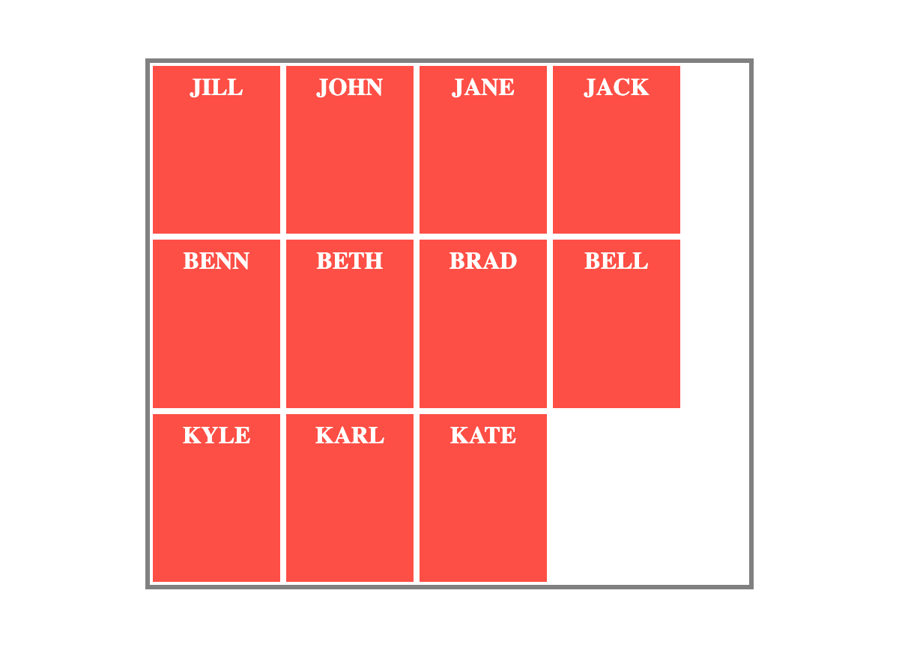
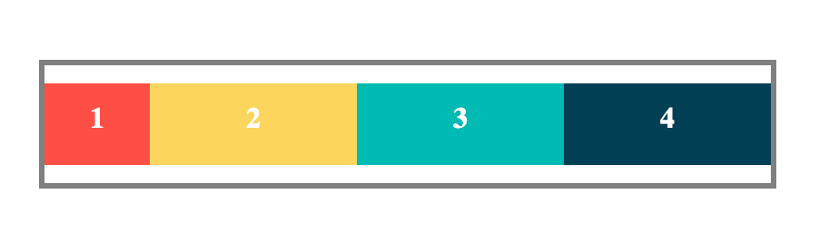
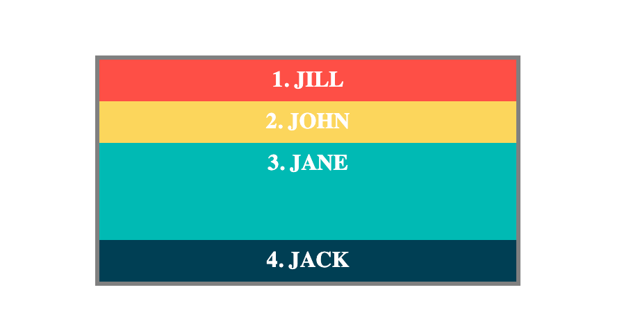

## hello world

- html
```html
<!doctype html>
<html lang="en">
  <head>
    <meta charset="utf-8" />
    <title>开始学习 CSS</title>
    <link rel="stylesheet" href="styles.css">
  </head>

  <body>
    <h1>我是一级标题</h1>

    <p>
      这是一个段落文本。在文本中有一个 <span>span element</span> 并且还有一个
      <a href="http://example.com">链接</a>.
    </p>

    <p>这是第二段。包含了一个 <em>强调</em> 元素。</p>

    <ul>
      <li>项目 1</li>
      <li>项目 2</li>
      <li>项目 <em>三</em></li>
    </ul>
  </body>
</html>
```

- css
```css
h1 {
    color: red;
}
```

- 一级标题变红


## 选择器类型


| 选择器   | 表示            |
| ----- | ------------- |
| 类选择器  | `.class_name` |
| id选择器 | `#id`         |


## 三种样式创建方式

1. 外部样式
```html
<head>
	<link rel="stylesheet" href="styles.css">
</head>
```
2.内部样式
```html
<head>
	<style>
		h1 {
		    color: red;
		}
	</style>
</head>
```
3. 内联样式
```html
<h1 style="color:red">我是一级标题</h1>
```

- 优先级
	- 内联 > 内部 > 外部 > 默认


## 盒子模型

所有HTML元素可以看作盒子，在CSS中，"box model"这一术语是用来设计和布局时使用。


- padding和border的影响

只设置元素的width和height的时候，实际设置的是content的大小，padding和border默认为0
```html
<!DOCTYPE html>
<html lang="en">
<head>
    <meta charset="UTF-8">
    <meta name="viewport" content="width=device-width, initial-scale=1.0">
    <title>Document</title>
    <style>
        .simple {
            width: 500px;
            height: 200px;
            margin: 20px auto;
            border: 10px solid;
        }
        .fancy{
            width: 500px;
            height: 200px;
            margin: 20px auto;
            border: 10px solid;
            padding: 50px;       # 去掉 padding后大小将一致
        }

    </style>
</head>
<body>
    <div class="simple">
        我小一些... 
    </div>
    <div class="fancy">
        我比它大！ 
    </div>
</body>
</html>
```


- 问题
	- 展现两个大小一样的盒子，但是padding和border的大小都不一样，又不想计算content的大小值的解决方案
		- 使用`box-sizing: border-box;`属性即可，上述代码使用之后的效果
		- 大小一样，区别是content区域自适应，content大小不一样
			- 


## 网页布局例子

- html
```html
<!DOCTYPE html>
<html lang="en">
<head>
    <meta charset="UTF-8">
    <meta name="viewport" content="width=device-width, initial-scale=1.0">
    <link rel="stylesheet" href="styles.css">
    <title>Document</title>
</head>
<body>
    <div class="header">
        <h1>my site</h1>
    </div>

    <div class="nav">
        <a href="#">链接</a>
        <a href="#">链接</a>
        <a href="#">链接</a>
        <a href="#" style="float: right;">链接</a>
    </div>

    <div class="content">
        <div class="leftcontent">
            <div class="card">
                <h2>文章标题</h2>
                <h5>2019 年 4 月 17 日</h5>
                <div class="fakeimg" style="height:200px;">图片</div>
                <p>一些文本...</p>
                <p>菜鸟教程 - 学的不仅是技术，更是梦想！菜鸟教程 - 学的不仅是技术，更是梦想！菜鸟教程 - 学的不仅是技术，更是梦想！菜鸟教程 - 学的不仅是技术，更是梦想！</p>
            </div>

        </div>
        <div class="rightcontent">
            <div class="card">
                <h2>关于我</h2>
                <div class="fakeimg" style="height:100px;">图片</div>
                <p>关于我的一些信息..</p>
            </div>
            <div class="card">
                <h3>热门文章</h3>
                <div class="fakeimg"><p>图片</p></div>
                <div class="fakeimg"><p>图片</p></div>
                <div class="fakeimg"><p>图片</p></div>
            </div>
            <div class="card">
                <h3>关注我</h3>
                <p>一些文本...</p>
            </div>
        </div>
    </div>
    <div class="footer">
        <h2>底部区域</h2>
    </div>

</body>
</html>
```

- css
```css
body{
    font-family: sans-serif;
    padding: 10px;
    background-color: #f1f1f1;
}

* {
    box-sizing: border-box; /* 宽度和高度包括内容区域、内边距和边框 */
  }

/* 头部div容器样式 */
.header{
    padding: 30px;
    background-color: white;
    text-align: center;

}

.header h1{
    font-size: 50px;
}

/**********************************************/
/* 导航条div容器样式 */
.nav{
    overflow: hidden;
    background-color: #333;
}

/* 导航条链接样式 */
.nav a{
    float: left;
    display: block;         /* 占用整行 */
    color: #f2f2f2;
    text-align: center;
    padding: 14px 16px;
    text-decoration: none;  /* 消除文字装饰（此处为取消链接下划线）*/
}

/* 鼠标悬停链接时的样式 */
.nav a:hover{
    background-color: #ddd;
    color: black;
}

/**********************************************/
/* 内容区样式 */

/* conten容器添加空块消除浮动 */
.content:after {
    content: "";
    clear: both;
    display: table;
}


/* 左边内容div容器样式 */
.leftcontent{
    float: left;
    width: 75%;
}

/* 卡片内容样式 */
.card{
    background-color: white;
    padding: 20px;
    margin-top: 20px;
}

/* 卡片内容图片样式 */
.fakeimg{
    background-color: #aaa;
    width: 100%;
    padding: 20px;
}

/* 右边内容样式 */
.rightcontent{
    float: left;
    width: 25%;
    background-color: #f1f1f1;
    padding-left: 20px;
}

.footer{
    padding: 20px;
    text-align: center;
    background-color: #ddd;
    margin-top: 20px;
}


/* 响应式布局 - 屏幕尺寸小于 800px 时，两列布局改为上下布局 */
@media screen and (max-width: 800px) {
    .leftcontent, .rightcontent {   
      width: 100%;
      padding: 0;
    }
  }
   
  /* 响应式布局 -屏幕尺寸小于 400px 时，导航等布局改为上下布局 */
  @media screen and (max-width: 400px) {
    .nav a {
      float: none;
      width: 100%;
    }
  }
```


## width和max-width  

- width  
当网页宽度小于width的时候会出现水平滚动条
```html
<!DOCTYPE html>
<html lang="en">
<head>
    <meta charset="UTF-8">
    <meta name="viewport" content="width=device-width, initial-scale=1.0">
    <title>Document</title>
    <style>
        #main{
            height: 200px;
            width: 600px;
            margin: 0 auto;
            background-color: red;
        }
    </style>
</head>
<body>
    <div id="main">

    </div>
</body>
</html>
```


- max-width  
相比width，窗口宽度变小的时候则不会出现水平滚动条，因为目标的宽度变化的范围为0-max-width


## position

- relative
```html
<!DOCTYPE html>
<html lang="en">
<head>
    <meta charset="UTF-8">
    <meta name="viewport" content="width=device-width, initial-scale=1.0">
    <title>Document</title>
    <style>
        .relative1{
            padding: 3em;
            height: 150px;
            width: 400px;
            border: 2px solid ;
			position: relative;
        }
        .relative2{
            padding: 3em;
            height: 150px;
            width: 400px;
            border: 2px solid red;
            position: relative;
            top: -20px;
            left: 20px;
        }
    </style>
</head>
<body>
    <div class="relative1">
        relative 表现的和 static 一样，除非你添加了一些额外的属性。 
    </div>

    <div class="relative2">
        在一个相对定位（position属性的值为relative）的元素上设置 top 、 right 、 bottom 和 left 属性会使其偏离其正常位置。其他的元素的位置则不会受该元素的影响发生位置改变来弥补它偏离后剩下的空隙。 
    </div>
    
</body>
</html>
```


- fixed
```html
<!DOCTYPE html>
<html lang="en">
<head>
    <meta charset="UTF-8">
    <meta name="viewport" content="width=device-width, initial-scale=1.0">
    <title>Document</title>
    <style>
        .relative1{
            padding: 3em;
            height: 150px;
            width: 400px;
            border: 2px solid ;
			position: relative;
        }
        .relative2{
            padding: 3em;
            height: 150px;
            width: 400px;
            border: 2px solid red;
            position: relative;
            top: -20px;
            left: 20px;
        }
    </style>
</head>
<body>
    <div class="relative1">
        relative 表现的和 static 一样，除非你添加了一些额外的属性。 
    </div>

    <div class="relative2">
        在一个相对定位（position属性的值为relative）的元素上设置 top 、 right 、 bottom 和 left 属性会使其偏离其正常位置。其他的元素的位置则不会受该元素的影响发生位置改变来弥补它偏离后剩下的空隙。 
    </div>
    
</body>
</html>
```


- absolute
absolute会相对于带有position:relative或者position:fixed的属性**父元素**进行相对定位，如果都没有，则对body进行相对定位  
```html
<!DOCTYPE html>
<html lang="en">
<head>
    <meta charset="UTF-8">
    <meta name="viewport" content="width=device-width, initial-scale=1.0">
    <title>Document</title>
    <style>
        .relative {
            border: 2px solid;
            position: relative; /*fixed也生效*/
            width: 600px;
            height: 400px;
        }
        .absolute {
            border: 2px solid;
            position: absolute;
            top: 120px;
            right: 0;
            width: 300px;
            height: 200px;
        }
    </style>
</head>
<body>
    <div class="relative">
        这个元素是相对定位的。如果它是 position: static; ，那么它的绝对定位子元素会跳过它直接相对于body元素定位。 
        
        <div class="absolute">
            这个元素是绝对定位的。它相对于它的父元素定位。 
        </div>
    </div>
</body>
</html>
```


### position布局例子

```html
<!DOCTYPE html>
<html lang="en">
<head>
    <meta charset="UTF-8">
    <meta name="viewport" content="width=device-width, initial-scale=1.0">
    <title>Document</title>
    <style>
        *{
            box-sizing:border-box;  /*width和height的大小包括border和padding*/
            margin: 1px 1px;
        }
        .container{
            position: relative;

            border: 3px solid yellow;
        }
        nav{
            position: absolute;   /* 这里以container为参照物绝对定位 */
            left: 0px;
            width: 200px;

            border: 3px solid red;
        }
        a{
            display: block;
        }
        section{
            margin-left: 200px;

            border: 3px solid black;
        }
        footer{
            position: fixed;     /* 位置固定在底部，高为70px，位置不随滚动条变化而变化 */
            bottom: 0;
            left: 0;
            height: 70px;
            background-color: white;
            width: 100%;

            border: 3px solid black;
        }
        body{
            margin-bottom: 120px;

            border: 2px solid blue;
        }
    </style>
</head>
<body>
    <div class="container">
        <nav>
            <a href="">Home</a>
            <a href="">Taco Menu</a>
            <a href="">Draft List</a>
            <a href="">Hours</a>
            <a href="">Directions</a>
            <a href="">Contact</a>
        </nav>
        <section>
            section 的 margin-left 样式确保了有足够的空间容纳 nav 元素。 
        </section>
        <section>
            Lorem ipsum dolor sit amet, consectetur adipiscing elit. Phasellus imperdiet, nulla et dictum interdum, nisi lorem egestas odio, vitae scelerisque enim ligula venenatis dolor. Maecenas nisl est, ultrices nec congue eget, auctor vitae massa. Fusce luctus vestibulum augue ut aliquet. Mauris ante ligula, facilisis sed ornare eu, lobortis in odio. Praesent convallis urna a lacus interdum ut hendrerit risus congue. Nunc sagittis dictum nisi, sed ullamcorper ipsum dignissim ac. In at libero sed nunc venenatis imperdiet sed ornare turpis. Donec vitae dui eget tellus gravida venenatis. Integer fringilla congue eros non fermentum. Sed dapibus pulvinar nibh tempor porta. Cras ac leo purus. Mauris quis diam velit.
        </section>
        <section>
            注意观察当你调整浏览器窗口时发生了什么。效果很赞！ 
        </section>
        <br><br><br><br><br><br><br><br><br><br><br><br><br><br><br><br><br><br><br><br><br>
        <br><br><br><br><br><br><br><br><br><br><br><br><br><br><br><br><br><br><br><br><br>
        <br><br><br><br><br><br><br><br><br><br><br><br><br><br><br><br><br><br><br><br><br>
        <br><br><br><br><br><br><br><br><br><br><br><br><br><br><br><br><br><br><br><br><br>
        <br><br><br><br><br><br><br><br><br><br><br><br><br><br><br><br><br><br><br><br><br>
        <br><br><br><br><br><br><br><br><br><br><br><br><br><br><br><br><br><br><br><br><br>
        <br><br><br><br><br><br><br><br><br><br><br><br><br><br><br><br><br><br><br><br><br>
        <br><br><br><br><br><br><br><br><br><br><br><br><br><br><br><br><br><br><br><br><br>
        <br><br><br><br><br><br><br><br><br><br><br><br><br><br><br><br><br><br><br><br><br>
        <br><br><br><br><br><br><br><br><br><br><br><br><br><br><br><br><br><br><br><br><br>
        <br><br><br><br><br><br><br><br><br><br><br><br><br><br><br><br><br><br><br><br><br>
        <br><br><br><br><br><br><br><br><br><br><br><br><br><br><br><br><br><br><br><br><br>

        <footer>
            如果你使用了一个固定定位的页眉或页脚，确保有足够的空间来显示它们！我在 body 上面加了 margin-bottom 。
        </footer>
    </div>
</body>
</html>
```


## float 

一个浮动元素会尽量向左或向右移动，直到它的外边缘碰到包含框或另一个浮动框的边框为止。  
浮动元素之后的元素将围绕它。  
浮动元素之前的元素将不会受到影响。  

```html
<!DOCTYPE html>
<html>
<head>
<meta charset="utf-8"> 
<title>菜鸟教程(runoob.com)</title>
<style>
    .box{
        float: left;
        width: 200px;
        height: 100px;
        margin: 1em;
        
        border: 1px solid red;
    }
    section{
        border: 1px solid;
        margin: 1px;
    }

</style>
</head>

<body>

    <section>
        在这个例子中， section 元素实际上是在 div 之后的（译注：DOM结构上）。然而 div 元素是浮动到左边的，于是 section 中的文字就围绕了 div ，并且 section 元素包围了整个元素。如果我们想让 section 显示在浮动元素之后呢？ 
    </section>

    <section>
        在这个例子中， section 元素实际上是在 div 之后的（译注：DOM结构上）。然而 div 元素是浮动到左边的，于是 section 中的文字就围绕了 div ，并且 section 元素包围了整个元素。如果我们想让 section 显示在浮动元素之后呢？ 
    </section>

    <div class="box">
        我感觉好像我在漂浮！
    </div>

    <section>
        在这个例子中， section 元素实际上是在 div 之后的（译注：DOM结构上）。然而 div 元素是浮动到左边的，于是 section 中的文字就围绕了 div ，并且 section 元素包围了整个元素。如果我们想让 section 显示在浮动元素之后呢？ 
    </section>

</body>
</html>
```

如图排第三的红色浮动框不影响前两个section，而排在它后面的section将会跟随在第二section之后排列（因为div已经float起来，腾出空间），但是其内容会围绕div。  


如果想让最后一个section排在浮动div之后，消除其浮动对自身的影响，则可以添加` clear: left;`代码和效果如下:    
上一个盒子的浮动方向是什么就消除什么。
```html
<!DOCTYPE html>
<html>
<head>
<meta charset="utf-8"> 
<title>菜鸟教程(runoob.com)</title>
<style>
    .box{
        float: left;
        width: 200px;
        height: 100px;
        margin: 1em;
        
        border: 1px solid red;
    }
    section{
        border: 1px solid;
        margin: 1px;
    }
    .after-box{
        clear: left;
    }

</style>
</head>

<body>

    <section>
        在这个例子中， section 元素实际上是在 div 之后的（译注：DOM结构上）。然而 div 元素是浮动到左边的，于是 section 中的文字就围绕了 div ，并且 section 元素包围了整个元素。如果我们想让 section 显示在浮动元素之后呢？ 
    </section>

    <section>
        在这个例子中， section 元素实际上是在 div 之后的（译注：DOM结构上）。然而 div 元素是浮动到左边的，于是 section 中的文字就围绕了 div ，并且 section 元素包围了整个元素。如果我们想让 section 显示在浮动元素之后呢？ 
    </section>

    <div class="box">
        我感觉好像我在漂浮！
    </div>

    <section class="after-box">
        在这个例子中， section 元素实际上是在 div 之后的（译注：DOM结构上）。然而 div 元素是浮动到左边的，于是 section 中的文字就围绕了 div ，并且 section 元素包围了整个元素。如果我们想让 section 显示在浮动元素之后呢？ 
    </section>

</body>
</html>
```


- 清除浮动
浮动导致的高度塌陷例子：  
img的父div高度已经塌陷成一条之间
```html
<!DOCTYPE html>
<html lang="en">
<head>
    <meta charset="UTF-8">
    <meta name="viewport" content="width=device-width, initial-scale=1.0">
    <title>Document</title>
</head>

<style>
    .father{
        border: 1px solid red;
    }
    img{
        float: right;
    }
</style>
<body>
    <div class="father">
        
    </div>
</body>
</html>
```


清除浮动：
img的父div添加`overflow: auto;`即可  
```html
<!DOCTYPE html>
<html lang="en">
<head>
    <meta charset="UTF-8">
    <meta name="viewport" content="width=device-width, initial-scale=1.0">
    <title>Document</title>
</head>

<style>
    .father{
        border: 1px solid red;
        overflow: auto;
    }
    img{
        float: right;
    }
</style>
<body>
    <div class="father">
        

    </div>
</body>
</html>
```


### 浮动布局例子 

用浮动布局实现之前的position布局例子：  
把nav改成左边浮动即可
```html
<html lang="en">
<head>
    <meta charset="UTF-8">
    <meta name="viewport" content="width=device-width, initial-scale=1.0">
    <title>Document</title>
    <style>
        *{
            box-sizing:border-box;  /*width和height的大小包括border和padding*/
            margin: 1px 1px;
        }
        .container{
            border: 3px solid yellow;
        }
        nav{
            float: left;
            width: 200px;
            border: 3px solid red;
        }
        a{
            display: block;
        }
        section{
            margin-left: 200px;
            border: 3px solid black;
        }
        footer{
            position: fixed;
            left: 0;
            bottom: 0;
            width: 100%;
            height: 70px;
            background-color: white;
            border: 3px solid black;
        }
    </style>
</head>
<body>
    <div class="container">
        <nav>
            <a href="">Home</a>
            <a href="">Taco Menu</a>
            <a href="">Draft List</a>
            <a href="">Hours</a>
            <a href="">Directions</a>
            <a href="">Contact</a>
        </nav>
        <section>
            section 的 margin-left 样式确保了有足够的空间容纳 nav 元素。 
        </section>
        <section>
            Lorem ipsum dolor sit amet, consectetur adipiscing elit. Phasellus imperdiet, nulla et dictum interdum, nisi lorem egestas odio, vitae scelerisque enim ligula venenatis dolor. Maecenas nisl est, ultrices nec congue eget, auctor vitae massa. Fusce luctus vestibulum augue ut aliquet. Mauris ante ligula, facilisis sed ornare eu, lobortis in odio. Praesent convallis urna a lacus interdum ut hendrerit risus congue. Nunc sagittis dictum nisi, sed ullamcorper ipsum dignissim ac. In at libero sed nunc venenatis imperdiet sed ornare turpis. Donec vitae dui eget tellus gravida venenatis. Integer fringilla congue eros non fermentum. Sed dapibus pulvinar nibh tempor porta. Cras ac leo purus. Mauris quis diam velit.
        </section>
        <section>
            注意观察当你调整浏览器窗口时发生了什么。效果很赞！ 
        </section>
        <section>
            注意观察当你调整浏览器窗口时发生了什么。效果很赞！ 
        </section>
        <section>
            注意观察当你调整浏览器窗口时发生了什么。效果很赞！ 
        </section>
        <section>
            注意观察当你调整浏览器窗口时发生了什么。效果很赞！ 
        </section>
        <section>
            Lorem ipsum dolor sit amet, consectetur adipiscing elit. Phasellus imperdiet, nulla et dictum interdum, nisi lorem egestas odio, vitae scelerisque enim ligula venenatis dolor. Maecenas nisl est, ultrices nec congue eget, auctor vitae massa. Fusce luctus vestibulum augue ut aliquet. Mauris ante ligula, facilisis sed ornare eu, lobortis in odio. Praesent convallis urna a lacus interdum ut hendrerit risus congue. Nunc sagittis dictum nisi, sed ullamcorper ipsum dignissim ac. In at libero sed nunc venenatis imperdiet sed ornare turpis. Donec vitae dui eget tellus gravida venenatis. Integer fringilla congue eros non fermentum. Sed dapibus pulvinar nibh tempor porta. Cras ac leo purus. Mauris quis diam velit.
        </section>
        <br><br><br><br><br><br><br><br><br><br><br><br><br><br><br><br><br><br><br><br><br>
        <br><br><br><br><br><br><br><br><br><br><br><br><br><br><br><br><br><br><br><br><br>
        <br><br><br><br><br><br><br><br><br><br><br><br><br><br><br><br><br><br><br><br><br>
        <footer>
            如果你使用了一个固定定位的页眉或页脚，确保有足够的空间来显示它们！我在 body 上面加了 margin-bottom 。
        </footer>
    </div>
</body>
</html>
```


## inline-block

你可以创建很多网格来铺满浏览器。在过去很长的一段时间内使用 float 是一种选择，但是使用 inline-block 会更简单。让我们看下使用这两种方法的例子：  

- float方式实现
```html
<!DOCTYPE html>
<html lang="en">
<head>
    <meta charset="UTF-8">
    <meta name="viewport" content="width=device-width, initial-scale=1.0">
    <title>Document</title>
    <style>
        .box{
            float: left;
            width: 200px;
            height: 100px;
            margin: 1em;
            border: 2px solid green;
        }
        .after-box{
            height: 100px;
            clear: left;
            border: 2px solid red;
        }
    </style>
</head>
<body>
    <div class="box">1</div>
    <div class="box">2</div>
    <div class="box">3</div>
    <div class="box">4</div>
    <div class="box">5</div>
    <div class="box">6</div>
    <div class="box">6</div>
    <div class="after-box">after-box</div>
    
</body>
</html>
```

- inline-block实现
```html
<!DOCTYPE html>
<html lang="en">
<head>
    <meta charset="UTF-8">
    <meta name="viewport" content="width=device-width, initial-scale=1.0">
    <title>Document</title>
    <style>
        .box{
            display: inline-block;
            width: 200px;
            height: 100px;
            margin: 1em;
            border: 2px solid green;
        }
        .after-box{
            height: 100px;
            border: 2px solid red;
        }
    </style>
</head>
<body>
    <div class="box">1</div>
    <div class="box">2</div>
    <div class="box">3</div>
    <div class="box">4</div>
    <div class="box">5</div>
    <div class="box">6</div>
    <div class="box">6</div>
    <div class="after-box">after-box</div>
    
</body>
</html>
```

- 区别
	- after-box不需要添加浮动消除`clear: left;`
	- box的display方式为`display: inline-block;`
- 效果一样


## flexbox-弹性盒子布局

###  主轴和交叉轴
- `flex-direction` 为 `row` 时的交叉轴和主轴

- `flex-direction` 为 `column` 时的交叉轴和主轴


### flex和inline-flex

- flex
	- 这使得 Flex 容器的行为类似块级元素

- inline-flex
	- 这使得 Flex 容器的行为就像一个内联元素

 

### flex容器属性

#### gap
- 设置flex布局子项之间的间距，适合在紧挨的时候使用此选项
- 使用场景
	- 如导航栏

#### **flex-direction**
- row
- column
#### **flex-wrap**
- **nowrap**（默认值）
	- 超出时多余的会溢出容器
- **wrap**
	- 超出时多余的会在下一行显示
- **wrap-reverse**
	- 超出时多余的会在上一行显示
#### **flex-row**
- flex-flow 属性是 flex-direction 和 flex-wrap 的简写表示
	- flex-flow: column wrap;
#### **justify-content**
- justify-content 属性处理 Flex 容器主轴上 Flex 项的对齐方式
	- **center**
		- 全部元素居中对齐
	- **space-between**
		- 这会将第一个 Flex 项放置在主轴的**起始**位置，并将最后一个项放置在主轴的**末尾**。然后，主轴上的空间在这些元素之间均匀分布。并不改变元素本身大小。
	- **space-evenly**
		- 这会在 Flex 项之间均匀分配空间。这意味着每项前后的空间都相同。
	- **space-around**
		- 和space-evenly 的区别是，首位与边界的距离是项之间距离的一半。
#### **align-items**
- align-items 属性处理 Flex 项在 Flex 容器交叉轴上的对齐方式。
- 是针对单行项目的对齐，影响的是每个项目在交叉轴上的位置。
	- **stretch**（默认值） 
		- 这会拉伸 Flex 项以填充 Flex 容器内的空间。
	- **flex-start**
		- 这会将 Flex 项放置在 Flex 容器的交叉轴的起始位置。
	- **flex-end**
		- 这会将 Flex 项放置在 Flex 容器的交叉轴的末尾位置。
	- **center**
		- 交叉轴的中心位置。
	- **baseline**
		- 第一行基线对齐（还有last baseline）。以最大元素作为基线。
	- 
#### **align-content**
- 是针对多行项目的对齐，影响的是行组之间的整体位置。
- **stretch**
	- 拉伸 Flex 行以填充 Flex 容器**交叉轴内**的空间。
	- **flex-start**
		- 这将把 Flex 行放置在容器的**交叉轴起始**位置。
	- **flex-end**
		- 这会将 Flex 行放置在容器的**交叉轴末尾**位置。
	- **flex-center**
		- 这会将 Flex 行放置在容器的交叉轴中心位置。
	- **space-between**
		- 这会将第一行放置在交叉轴的起始位置。它还会将最后一行放置在交叉轴的末尾位置。然后，交叉轴上的空间会均匀分配给这些行。类似于设置**justify-content**的属性，这里设置的是**交叉轴**方向。
	- **space-evenly**
	- **space-around**
#### **place-content**
- 如果你需要同时使用 justify-content 和 align-content 属性，你可以使用 place-content 缩写属性。
- 它可以接受一个或两个值。当你给它一个单一值时，浏览器会为 justify-content 和 align-content 应用相同的值。
- 当你为 place-content 提供两个值时，第一个值将用于 align-content ，第二个值将用于 justify-content。

### flex项属性

#### order
- order 属性确定 Flex 项的出现顺序。

#### align-self
- 它的工作方式与 align-items 属性相同。不同之处在于， align-items 适用于所有 Flex 项，而 align-self 属性仅适用于特定项。
#### flex-grow
- 当你将容器的 display 设置为 flex 时，通常会在排列项之后有一些额外的空间。浏览器会将多余的空间视为 **1** 的值。
- **flex-grow** 设置为 0.5 时，浏览器会将剩余空间的一半添加到该项的大小中。
- 设置了 flex-grow 值为 1 ，浏览器将把所有额外的空间都分配给该项。
- 当你为多个元素添加 flex-grow 值时。
	- 浏览器将按比例为它们共享额外的空间。
	- 例如，当你给 Jane 设置 flex-grow 为 3，给 Jack 设置 flex-grow 为 1 时，浏览器将以 3:1 的比例分享额外的空间。
	- 这意味着额外空间的总值变为 4（3+1）。Jane 将获得额外空间的 3/4，而 Jack 将获得 1/4。
- 

#### flex-shrink
- flex-shrink 属性与 flex-grow 相反。
- 当你希望在存在额外空间时增加 Flex 项的大小时，你可以使用 flex-grow。但是，当 Flex 容器中的空间不足时，你可以使用 flex-shrink 来减小 Flex 项的大小。
- 第一张卡片缩小，为其他卡片腾出空间，卡片1的flex-shrink 的值为 2。
- 为了防止 Flex 项收缩，给它一个 flex-shrink 值为 0。
- 当你为 Number 1 指定 flex-shrink 为 0 时，它将保持 150px 的宽度。其他 Flex 项将缩小以适应剩余空间。

#### flex-basis
- 使用 flex-basis 属性来设置特定 Flex 项的默认长度。这取决于 flex-direction ，可以是宽度或高度。
- 如果 flex-direction 是 row 或 row-reverse ，则 flex-basis 的值就成为 Flex 项的初始宽度。
- 如果 flex-direction 是 column 或 column-reverse ，那么 flex-basis 的值就成为 Flex 项的初始高度。

如
```css
.names-container {  
	display: flex;  
	flex-direction: column;  
	/* Other styles */
}

div {  
	height: 20px;
}

#jane {  
	flex-basis: 60px;
}
```


#### flex
- 使用 flex 作为 flex-grow、flex-shrink 和 flex-basis 属性的缩写。


## 参考

- https://developer.mozilla.org/zh-CN/docs/Learn/CSS
- https://www.runoob.com/css
- https://zh.learnlayout.com/
- https://developer.mozilla.org/zh-CN/docs/Web/CSS
- https://www.freecodecamp.org/chinese/news/the-css-flexbox-handbook/  
- https://www.joshwcomeau.com/css/interactive-guide-to-flexbox/
- https://www.joshwcomeau.com/css/interactive-guide-to-grid/
