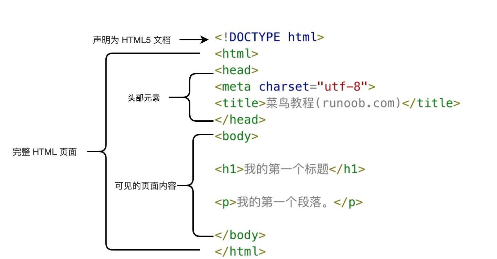

## 开发环境
```
vscode
# 插件
Live Preview
```


## Hello World

- 基本框架:html(head,body)
```html
<!DOCTYPE html>

<html>
    <head>
        <title>this is title</title>
    </head>

    <body>
        <p>this is body</p>
    </body>
</html>
```




## html 属性

- HTML 元素可以设置属性
- 属性一般描述于开始标签
- 属性总是以名称/值对的形式出现，比如：name="value"
- 大小写不敏感，推荐使用小写
```html
<!-- 跳转到 http://127.0.0.1:3000/www.runoob.com -->
<a href="www.runoob.com">link</a> 
<br/>
<!-- 跳转到 https://www.runoob.com/ -->
<a href="https://www.runoob.com">link2</a> 
```


| 属性          | 描述                                                                                                                                |
| ----------- | --------------------------------------------------------------------------------------------------------------------------------- |
| class       | 给元素指定一个或多个类名，方便通过 CSS 或 JavaScript 操作                                                                                             |
| id          | 给元素一个唯一的标识符，可以用于 CSS 选择器或 JavaScript 操作                                                                                           |
| style       | 直接为元素定义 CSS 样式，如`<span style="color: red;">This text is red.</span>`                                                              |
| title       | 鼠标悬停的时候显示的信息，类似tooltip                                                                                                            |
| src         | `用于  和 <script> 标签，指定资源的路径`                                                                                                  |
| alt         | 用于  标签，提供图片的替代文本,图片无法获取的时候显示的文本                                                                                              |
| name        | 定义元素名称，在`<input>, <form>, <select>` 等表单元素中使用                                                                                      |
| value       | 定义表单元素值，`<input type="text" value="default value">`                                                  |
| target      | `用于 <a> 标签，指定链接的打开方式（如 _blank 在新窗口中打开）`<br>`<a href="https://www.example.com" target="_blank" rel="noopener">Open in new tab</a>` |
| type        | 指定表单元素的类型（如 text, password, submit）                                                                                               |
| placeholder | `为 <input> 和 <textarea> 提供一个占位符文本`<br>`<input type="text" placeholder="Enter your name">`                                         |

## html 标题

```html
<h1>这是一个标题。</h1>
<!-- 水平线 -->
<hr>
<h2>这是一个标题。</h2>
<hr>
<h3>这是一个标题。</h3>
```


## html 文本格式化

| 标签      | 描述           |
| ------- | ------------ |
| `<del>` | ~~定义删除字~~    |
| `<ins>` | <u>定义插入字</u> |
| `<b>`   | 加粗           |


## html 链接

如果指定了文件名，浏览器会提示下载并保存为指定文件名
```html
<a href="file.pdf" download="example.pdf">下载文件</a>
```

- id：用于链接锚点，通常在同一页面中跳转到某个特定位置
```html
<!-- 链接到页面中的某个部分 -->
<a href="#section1">跳转到第1部分</a>
<br><br><br><br><br><br><br><br><br><br><br><br><br>
<br><br><br><br><br><br><br><br><br><br><br><br><br>
<br><br><br><br><br><br><br><br><br><br><br><br><br>
<br><br><br><br><br><br><br><br><br><br><br><br><br>
<div id="section1">这是第1部分</div>
<br><br><br><br><br><br><br><br><br><br><br><br><br>
<br><br><br><br><br><br><br><br><br><br><br><br><br>
<br><br><br><br><br><br><br><br><br><br><br><br><br>
<br><br><br><br><br><br><br><br><br><br><br><br><br>
```

- type: 指定链接资源的MIME类型
```html
<a href="style.css" type="text/css">样式表</a>
```


## html 头部

脚本、样式、各种meta信息在head头部插入

- link元素，通常用于链接css样式
```html
<link rel="stylesheet" type="text/css" href="style.css">
```

- style元素,直接添加样式来渲染 当前HTML 文档
```html
<head>
	<style type="text/css">
		body {
		    background-color:yellow;
		}
		p {
		    color:blue
		}
	</style>
</head>
```

- script元素，用于加载脚本文件，如：JavaScript

## html 样式

CSS (Cascading Style Sheets) 用于渲染HTML元素标签的样式

- 在元素内使用样式
```html
<h1 style="text-align:center;">居中对齐的标题</h1>
```
- 内部样式
```html
<head>
	<style type="text/css">
		body {
		    background-color:yellow;
		}
		p {
		    color:blue
		}
	</style>
</head>
```

- 外部样式
```html
<head>
<link rel="stylesheet" type="text/css" href="mystyle.css">
</head>
```


## html 表格

表格不是表单

- table
	- thead
	- tbody
		- thead、tbody里面每一行都要用tr包围
			- tr tr里面th代表加粗的标题、td代表表格数据
				- th
				- td
- 如
```html
<table>
	<caption>Monthly savings</caption>
	<thead>
		<tr>
			<th>header1</th>
			<th>header2</th>
			<th>header3</th>
		</tr>
	</thead>
	<tbody>
		<tr>
			<td>body1</td>
			<td>body2</td>
			<td>body3</td>
		</tr>
		<tr>
			<td>body1</td>
			<td>body2</td>
			<td>body3</td>
		</tr>
	</tbody>
</table>
```


- 表格内单元可以跨行跨列、内嵌元素
	- 更多参考https://www.runoob.com/html/html-tables.html 更多实例


## html 列表

- 有序列表 ol
- 无序列表 ul

## html 区块

## html 布局

使用div和样式实现布局的例子
```html

<!DOCTYPE html>
<html>
    <head> 
        <meta charset="utf-8"> 
        <title>菜鸟教程(runoob.com)</title> 
    </head>

    <body>
        <!-- 总体布局容器 -->
        <div id="container" style="width:500px">
        
            <!-- 标题栏容器 -->
            <div id="header" style="background-color:#FFA500;">
                <h1 style="margin-bottom:0;">主要的网页标题</h1>
            </div>
            
            <!-- 菜单栏容器 -->
            <div id="menu" style="background-color:#FFD700;height:200px;width:100px;float:left;">
                <b>菜单</b><br>
                HTML<br>
                CSS<br>
                JavaScript
            </div>
            
            <!-- 内容容器 -->
            <div id="content" style="background-color:#EEEEEE;height:200px;width:400px;float:left;">
                内容在这里
            </div>
            
            <!-- 底部版权声明容器 -->
            <div id="footer" style="background-color:#FFA500;clear:both;text-align:center;">
                版权 © runoob.com
            </div>
        
        </div>

    </body>
</html>
```


## html 表单

html表单用于收集用户的输入信息，表示文档中的一个区域，此区域包含交互控件，收集到的用户信息发送到Web服务器

- form创建表单
	- action属性定义提交的url
	- method属性定义提交的方式post或者get
	- label标签
	- input标签为用户输入框
		- type可以为text、passwprd等
	- select标签创建下拉选择输入框
		- option标签定义下拉列表的元素

- 例子
```html
<form action="/" method="post">
    <!-- 文本输入框 -->
    <!-- for的作用是与指定的表单绑定，点击的时候会自动将焦点移动到绑定元素上 -->
    <label for="name">用户名:</label>
    <!-- name为提交到服务器的参数名,值为value的值 -->
    <input type="text" id="name" name="name" required>

    <br>

    <!-- 密码输入框 -->
    <label for="password">密码:</label>
    <input type="password" id="password" name="password" required>

    <br>

    <!-- 单选按钮 -->
    <!-- id必须唯一，但是name可以不唯一这在复选框、单选按钮等多元素表单项中非常有用 -->
    <label>性别:</label>
    <input type="radio" id="male" name="gender" value="male" checked>
    <label for="male">男</label>
    <input type="radio" id="female" name="gender" value="female">
    <label for="female">女</label>

    <br>

    <!-- 复选框 -->
    <input type="checkbox" id="subscribe" name="subscribe" checked>
    <label for="subscribe">订阅推送信息</label>

    <br>

    <!-- 下拉列表 -->
    <label for="country">国家:</label>
    <select id="country" name="country">
        <option value="cn">CN</option>
        <option value="usa">USA</option>
        <option value="uk">UK</option>
    </select>

    <br>

    <!-- 提交按钮 -->
    <!-- 当用户单击确认按钮时，表单的内容会被传送到服务器。表单的动作属性 action 定义了服务端的文件名 -->
    <!-- action 属性会对接收到的用户输入数据进行相关的处理 -->
    <input type="submit" value="提交">
</form>
```

## html 脚本

嵌入脚本
```html
<!DOCTYPE html>
<html>
    <head> 
        <meta charset="utf-8"> 
        <title>菜鸟教程(runoob.com)</title> 
    </head>
    <script>
        document.write("<h1>这是一个标题</h1>");
    </script>
    <body>
        <!-- 可以在任何地方嵌入 -->
        <script>
            document.write('hello world')
        </script>
    </body>
</html>
```


## html 速查

- https://www.runoob.com/html/html-quicklist.html


## html 画布（canvas）

canvas用于图形的绘制，使用js来完成，canvas只是图形容器

```html
<!DOCTYPE html>
<html lang="zh">
    <head>
        <meta charset="UTF-8">
        <title>页面标题</title>
    </head>

    <body>
        <!-- 声明画布 -->
        <canvas id="myCanvas" width="200" height="100"
            style="border:1px solid #000000;">
        </canvas>
        
    </body>

    <script>
        // 需要在canvas标签后声明js代码块才能获取到myCanvas这个id
        var c = document.getElementById("myCanvas")
        var ctx=c.getContext("2d");
        ctx.fillStyle="#FF0000";
        ctx.fillRect(0,0,150,75);
    </script>
</html>
```

## html SVG

- SVG 定义为可缩放矢量图形
- SVG 图像在放大或改变尺寸的情况下其图形质量不会有损失
- SVG 是一种使用 XML 描述 2D 图形的语言
- 不依赖分辨率


## html 视频

```html
<!DOCTYPE html>
<html lang="zh">
    <head>
        <meta charset="UTF-8">
        <title>页面标题</title>
    </head>

    <body>
        <video width="320" height="240" controls>
            <source src="movie.mp4" type="video/mp4">
            <source src="movie.ogg" type="video/ogg">
            您的浏览器不支持 HTML5 video 标签。
        </video>
        
    </body>
</html>
```


## html 音频


```html
<!DOCTYPE html>
<html lang="zh">
    <head>
        <meta charset="UTF-8">
        <title>页面标题</title>
    </head>

    <body>
        <audio controls>
            <source src="horse.ogg" type="audio/ogg">
            <source src="horse.mp3" type="audio/mpeg">
          您的浏览器不支持 audio 元素。
        </audio>
        
    </body>
</html>
```


## html Web Workers

- 当在 HTML 页面中执行脚本时，页面的状态是不可响应的，直到脚本已完成。
- web worker 是运行在后台的 JavaScript，独立于其他脚本，不会影响页面的性能。您可以继续做任何愿意做的事情：点击、选取内容等等，而此时 web worker 在后台运行。

- https://www.runoob.com/html/html5-webworkers.html


## html WebSocket

| 事件      | 事件处理程序           | 描述            |
| ------- | ---------------- | ------------- |
| open    | Socket.onopen    | 连接建立时触发       |
| message | Socket.onmessage | 客户端接收服务端数据时触发 |
| error   | Socket.onerror   | 通信发生错误时触发     |
| close   | Socket.onclose   | 连接关闭时触发       |

- 浏览器
```html
<!DOCTYPE html>
<html>
<head>
    <title>WebSocket 测试</title>
</head>
<body>
    <h2>WebSocket 测试</h2>
    <div>
        <input type="text" id="messageInput" placeholder="输入消息">
        <button onclick="sendMessage()">发送</button>
    </div>
    <div>
        <h3>消息记录：</h3>
        <div id="messages"></div>
    </div>

    <script>
        // 创建 WebSocket 连接
        const ws = new WebSocket('ws://localhost:8765');
        const messagesDiv = document.getElementById('messages');

        // 连接建立时的处理
        ws.onopen = function() {
            console.log('WebSocket 连接已建立');
            appendMessage('系统: WebSocket 连接已建立');
        };

        // 接收服务器消息的处理
        ws.onmessage = function(event) {
            console.log('收到服务器消息:', event.data);
            appendMessage('服务器: ' + event.data);
        };

        // 连接关闭时的处理
        ws.onclose = function() {
            console.log('WebSocket 连接已关闭');
            appendMessage('系统: WebSocket 连接已关闭');
        };

        // 发生错误时的处理
        ws.onerror = function(error) {
            console.error('WebSocket 错误:', error);
            appendMessage('错误: ' + error);
        };

        // 发送消息的函数
        function sendMessage() {
            const input = document.getElementById('messageInput');
            const message = input.value;
            
            if (message) {
                ws.send(message);
                appendMessage('客户端: ' + message);
                input.value = '';
            }
        }

        // 在页面上添加消息的函数
        function appendMessage(message) {
            const messageElement = document.createElement('div');
            messageElement.textContent = message;
            messagesDiv.appendChild(messageElement);
            // 滚动到最新消息
            messagesDiv.scrollTop = messagesDiv.scrollHeight;
        }
    </script>
</body>
</html>
```

- py后端代码
```python

import asyncio
import websockets  # pip install websockets


# 处理WebSocket连接的函数
async def handler(websocket):
    try:
        while True:
            # 接收客户端消息
            message = await websocket.recv()
            print(f"收到客户端消息: {message}")
            
           
            # 发送响应给客户端
            response = f"服务器收到: {message}"
            await websocket.send(response)
            
    except websockets.ConnectionClosed:
        print("客户端断开连接")

# 启动WebSocket服务器
async def main():
    server = await websockets.serve(handler, "localhost", 8765)
    print("WebSocket服务器启动在 ws://localhost:8765")
    await server.wait_closed()

if __name__ == "__main__":
    asyncio.run(main())
```


## 参考

- https://www.runoob.com/html