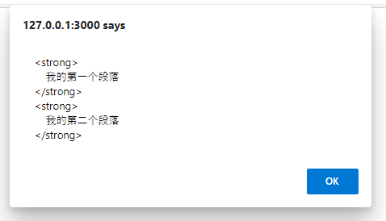
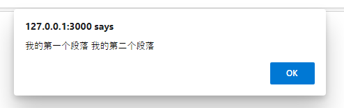
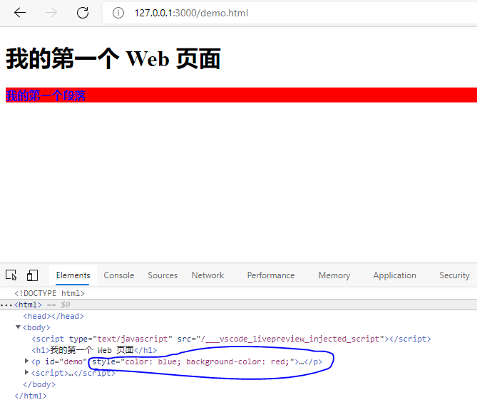

为什么学习 JavaScript?

JavaScript 是 web 开发人员必须学习的 3 门语言中的一门：
- HTML 定义了网页的内容
- CSS 描述了网页的布局
- JavaScript 控制了网页的行为


## hello world

```html
<!DOCTYPE html>
<html lang="en">
<head>
    <meta charset="UTF-8">
    <title>Document</title>
</head>
<body>
    <script>
        function onClick(){
            document.getElementById("time").innerText = Date();
        }
    </script>
    <h1 id="time"></h1>
    <br>
    <button onclick="onClick()">显示时间</button>

</body>
	</html>
```

## 操作html元素

innerHTML和innerText区别  
例子
```html
<!DOCTYPE html>
<html>
<body>

<h1>我的第一个 Web 页面</h1>

<p id="demo">
    <strong>
        我的第一个段落
    </strong>
    <strong>
        我的第二个段落
    </strong>
</p>

<script>
    alert(document.getElementById("demo").innerHTML);
    alert(document.getElementById("demo").innerText);
</script>

</body>
</html>
```
- 效果
	- 
	- 


## 变量

```javascript
var lastname="Doe", age=30, job="carpenter"; 
```


## 对象

- JavaScript 对象就是一个 name:value 集合
```js
<script>
var person = {
    firstName: "John",
    lastName : "Doe",
    id : 5566,
    fullName : function() 
	{
       return this.firstName + " " + this.lastName;
    }
};
document.getElementById("demo").innerHTML = person.fullName();
</script>
```

- 使用对象构造器
```js
function person(firstname,lastname,age,eyecolor){
	this.firstname=firstname;
	this.lastname=lastname;
	this.age=age;
    this.eyecolor=eyecolor;
}
myFather=new person("John","Doe",50,"blue");
console.log(myFather.firstname + " is " + myFather.age + " years old.");
```

- JavaScript 的对象是可变的  
对象是可变的，它们是通过引用来传递的。
## 改变html样式

```js
<!DOCTYPE html>
<html>
<body>

<h1>我的第一个 Web 页面</h1>

<p id="demo">
    <strong>
        我的第一个段落
    </strong>
</p>

<script>
    document.getElementById("demo").style.color="blue";
    document.getElementById("demo").style.backgroundColor = "red";
</script>

</body>
</html>
```

- 效果



## HTML DOM 元素 (节点)操作

- 在p2后面添加新的p标签，此外还可以指定位置前后插入、删除
```html
<div id="div1">
<p id="p1">这是一个段落。</p>
<p id="p2">这是另外一个段落。</p>
</div>
 
<script>
var para = document.createElement("p");
var node = document.createTextNode("这是一个新的段落。");
para.appendChild(node);
 
var element = document.getElementById("div1");
element.appendChild(para);
</script>
```


## Number 对象

- 所有 JavaScript 数字均为 64 位


## Array（数组） 对象

```js
var mycars = new Array();
mycars[0] = "Saab";
mycars[1] = "Volvo";
mycars[2] = "BMW";

// or 
var myCars=new Array("Saab","Volvo","BMW");
```


## JSON

- JSON字符串与对象之间的转换
```js
var text = '{ "sites" : [' +
'{ "name":"Runoob" , "url":"www.runoob.com" },' +
'{ "name":"Google" , "url":"www.google.com" }]}';
console.log(text)

// json字符串转对象
var obj = JSON.parse(text);
console.log(obj.sites[0].name)

// json对象转字符串
obj.sites[0].name = "Runoob2"
console.log(JSON.stringify(obj))

// 输出
{ "sites" : [{ "name":"Runoob" , "url":"www.runoob.com" },{ "name":"Google" , "url":"www.google.com" }]}
Runoob
{"sites":[{"name":"Runoob2","url":"www.runoob.com"},{"name":"Google","url":"www.google.com"}]}
```

## 异步编程

- setTimeout  

```js
// 既然 setTimeout 会在子线程中等待 3 秒，在 setTimeout 函数执行之后主线程并没有停止，所以
setTimeout(function () {
    document.getElementById("demo1").innerHTML="RUNOOB-1!";  // 三秒后子线程执行
}, 3000);
document.getElementById("demo2").innerHTML="RUNOOB-2!";      // 主线程先执行
```


- 异步 AJAX获取网页信息

```html
<!DOCTYPE html>
<html>
<head> 
<meta charset="utf-8"> 
<title>菜鸟教程(runoob.com)</title> 
</head>
<body>

<p><strong>以下内容是通过异步请求获取的：</strong></p>
<p id="demo"></p>
<script>
var xhr = new XMLHttpRequest();
 
xhr.onload = function () {
    // 输出接收到的文字数据
    document.getElementById("demo").innerHTML=xhr.responseText;
}
 
xhr.onerror = function () {
    document.getElementById("demo").innerHTML="请求出错";
}
 
// 发送异步 GET 请求
xhr.open("GET", "/try/ajax/ajax_info.txt", true);
xhr.send();
</script>

</body>
</html>
```

XMLHttpRequest 的 onload 和 onerror 属性都是函数，分别在它请求成功和请求失败时被调用。如果你使用完整的 jQuery 库，也可以更加优雅的使用异步 AJAX:  
```js
$.get("https://www.runoob.com/try/ajax/demo_test.php",function(data,status){
    alert("数据: " + data + "\n状态: " + status);
});
```
### Promise

在JavaScript中，Promise 是一种用于处理异步操作的对象。它代表一个可能在未来某个时间点完成或失败的操作。Promise 有三种状态：pending（进行中）、fulfilled（已完成）和 rejected（已拒绝）。  

- Promise 的基本语法
```js
const myPromise = new Promise((resolve, reject) => {
    // 模拟异步操作
    setTimeout(() => {
        resolve("操作成功"); // 将状态改为 fulfilled
    }, 3000);
});

myPromise.then(result => {
    console.log(result); // 输出: 操作成功
});
```
- resolve(value)
	- 这是一个方法，用于将 Promise 的状态从 pending 改变为 fulfilled。当你调用 resolve 时，你可以传递一个值，这个值将成为 Promise 的结果。之后，你可以使用 .then() 方法来处理这个结果。
- reject(reason)
	- 这是另一个方法，用于将 Promise 的状态从 pending 改变为 rejected。当你调用 reject 时，你可以传递一个原因（通常是一个错误对象），这个原因将成为 Promise 失败的原因。之后，你可以使用 .catch() 方法来处理这个错误。


- “函数瀑布”问题
```js
// 三次输出字符串，第一次间隔 1 秒，第二次间隔 4 秒，第三次间隔 3 秒
// 繁杂
setTimeout(function () {
    console.log("First");
    setTimeout(function () {
        console.log("Second");
        setTimeout(function () {
            console.log("Third");
        }, 3000);
    }, 4000);
}, 1000);
```

- 使用Promise实现同样的问题更加的清晰

```js
new Promise((resolve,reject) =>{
    setTimeout(()=>{
        console.log("First")
        resolve()
    },1000)
}).then(()=>{
    return new Promise((resolve,reject)=>{
        setTimeout(()=>{
            console.log("Second")
            resolve()
        },4000)
    })
}).then(()=>{
    setTimeout(()=>{
        console.log("Third")
    },3000)
})
```

- 错误处理
```js
new Promise((resolve,reject) =>{
    setTimeout(()=>{
        console.log("First")
        resolve()
    },3000)
}).then(()=>{
    return new Promise((resolve,reject)=>{
        setTimeout(()=>{
            console.log("Second")
            // resolve()
            reject("second error")
        },4000)
    })
}).then(()=>{
    setTimeout(()=>{
        console.log("Third")
    },3000)
}).catch(error =>{// 处理任何一个 Promise 的错误
    console.error(error)
})
```

### async

async 是 JavaScript 中处理异步操作的一种语法糖，它使得异步代码的写法更加简洁和易读。async 和 await 是一起使用的  
针对前面promise，还可以这样  
```
async function asyncFunc() {
    await print(1000, "First");
    await print(4000, "Second");
    await print(3000, "Third");
}
asyncFunc();
```


如果 Promise 有一个正常的返回值，await 语句也会返回它
```js
async function asyncFunc() {
    let value = await new Promise(
        function (resolve, reject) {
            resolve("Return value");
        }
    );
    console.log(value);
}
asyncFunc();

// 输出
Return value
```

- 错误处理  
使用 async 和 await 处理错误时，可以使用 try...catch 语句，这样可以更直观地捕捉和处理错误。  
```js
async function fetchData() {
    try {
        const response = await fetch("https://api.example.com/data");
        if (!response.ok) {
            throw new Error("网络响应不是 OK");
        }
        const data = await response.json();
        return data;
    } catch (error) {
        console.error("出错了:", error);
    }
}
```


## NODE.JS

从本章开始，我们编写的JavaScript代码将不能在浏览器环境中执行了，而是在Node环境中执行，因此，JavaScript代码将直接在你的计算机上以命令行的方式运行，所以，我们要先选择一个文本编辑器来编写JavaScript代码，并且把它保存到本地硬盘的某个目录，才能够执行。

### npm

- https://www.cnblogs.com/importsober/p/15357772.html
### hello world

```js
// hello.js
console.log("hello world");

// 运行 node hello.js
// 输出
hello world
```

### 使用模块

一个js文件就是一个模块，模块的名字就是文件名（去掉.js后缀），所以hello.js文件就是名为hello的模块。把hello.js改造一下，创建一个函数，这样我们就可以在其他地方调用这个函数：

```js
// hello.js

function hello(name){
    console.log("hello "+name);
}

const testvar = "testvar"

// 可以将函数，变量导出
module.exports = {
    hello,
    testvar
}
```

- 调用模块
```js
const hello = require("./node")


hello.hello("alice")

console.log(hello.testvar)

// 输出
hello alice
testvar
```

### 使用ESM模块

- ESM模块默认启用strict模式，无需声明'use strict'

虽然Node.js从诞生起就支持模块，但JavaScript语言本身长期以来却一直没有模块功能，只能由CommonJS或其他AMD等模块系统来“模拟”。  

随着ES 6标准的推出，JavaScript语言本身终于也迎来了原生内置的模块支持，称为ECMAScript Modules（简称ESM），不仅可以直接在浏览器中使用模块，也可以在Node.js中使用ESM模块。  

使用JavaScript内置的原生模块时，用关键字export和import来实现导出与导入；

- 导出
```js
let s = 'Hello';

// out是模块内部函数，模块外部不可见:
function out(prompt, name) {
    console.log(`${prompt}, ${name}!`);
}

// greet是导出函数，可被外部调用:
export function greet(name) {
    out(s, name);
}

// hi是导出函数，可被外部调用:
export function hi(name) {
    out('Hi', name);
}
```

- 导入

```js
import { greet, hi } from './hello.mjs';

let name = 'Bob';
greet(name);
hi(name);
```

- 浏览器加载ESM
```html
<html>
<head>
    <script type="module" src="./example.js"></script>
    <script type="module">
        greet('Bob');
    </script>
</head>
...
</html>
```
## 参考

- https://www.runoob.com/js/js-tutorial.html
- https://liaoxuefeng.com/books/javascript/nodejs/first-node-app/index.html